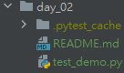

# Python 與自動化測試的敲門磚_Day02_Pytest 的快速入門
每天的專案會同步到 github 上，可以前往 [這個網址](https://github.com/nickchen1998/2022_ithelp_marathon)
如果對於專案有興趣或是想討論一些問題，歡迎留言 OR 來信討論，信箱為：nickchen1998@gmail.com

今天我們會針對 pytest 做快速入門，會教大家如何快速的建立 test case，另外補充一下筆者這邊使用的開發環境
- IDE：Pycharm
- Python：3.10
- 虛擬環境：poetry

## 一、安裝套件
```bash
pip install pytest
```
or 
```bash
poetry add pytest
```

## 二、pytest 的命名
### (一)、檔案的命名
pytest 會自動根據你所在的檔案路徑下，自動去搜尋所有檔案開頭為 test 的檔案 (如下圖)，並且當你用 pytest 執行該 python 檔案時，會在同一層目錄
下新增 `.pytest_cache` 目錄，此為 pytest 自動產生的，無須理會



### (二)、函式的命名
通常我們會將每個單元測試的函式一一分離，而在 pytest 中，單元測式的函式同樣要使用 test 作為開頭，下方為簡單的範例
```python
def test_first_case():
    assert 1 + 1 == 2
```
在範例中我們可以看到有一個很簡易的函式，並且使用 test 開頭，而 `assert` 我們可以理解成驗證，
利用這個功能我們可以逐一驗證我們的函式所產出的結果、資料是否正確

### (三)、利用 clss 建立 test case
另外我們也可以使用 class 的方式來建立我們的 test case，和函式的差別在於，使用 class 進行測試程式撰寫時，
我們同時也可以為 class 建立屬性給 class 內的函式進行使用，這部份我們會在後面挑一天進行說明，下面為簡易的範例
```python
class TestClassDemo:
    def test_case_one(self):
        assert 1 + 1 == 2

    def test_case_two(self):
        assert 2 + 2 == 4
```

以上就是快速建立 pytest test case 的方式，明天我們會教學如何執行 pytest

## 三、內容預告
明天我們會教大家如何利用 Pycharm (包含設定 pytest 執行) 以及 Terminal 執行 pytest 來進行測試