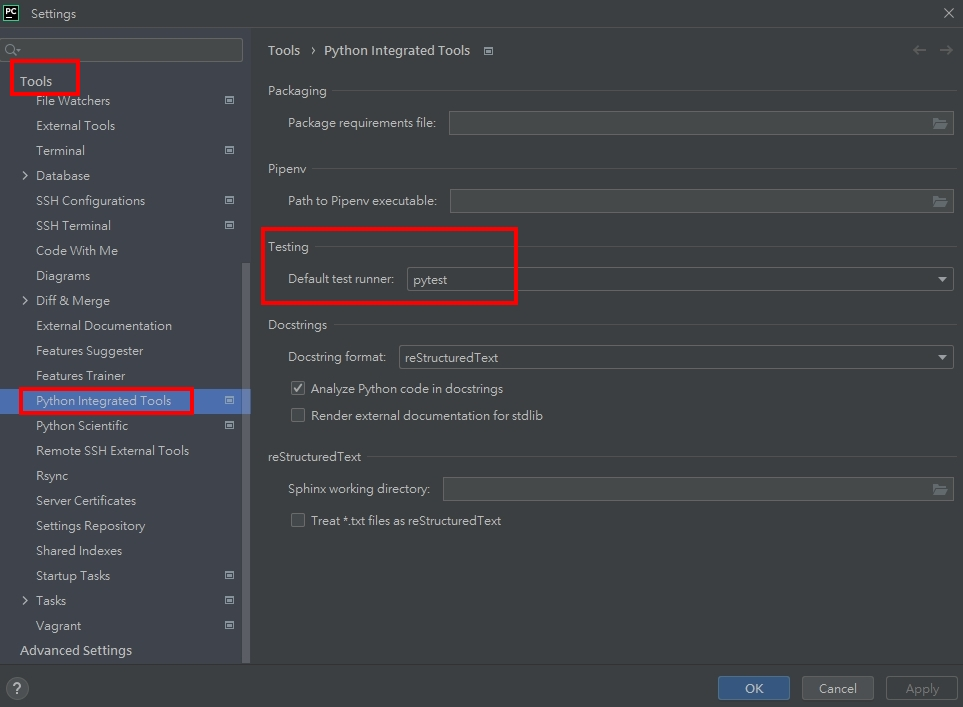
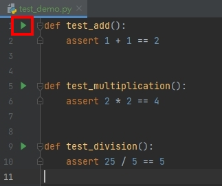
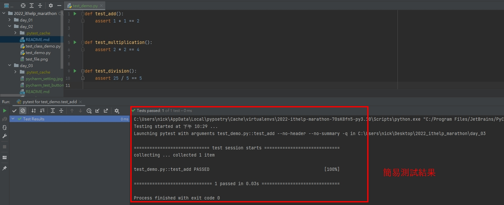
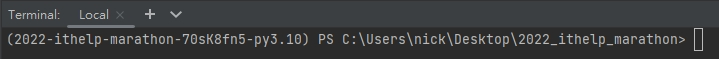
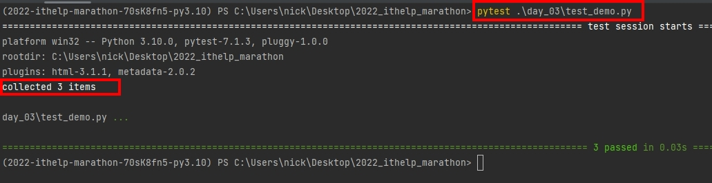
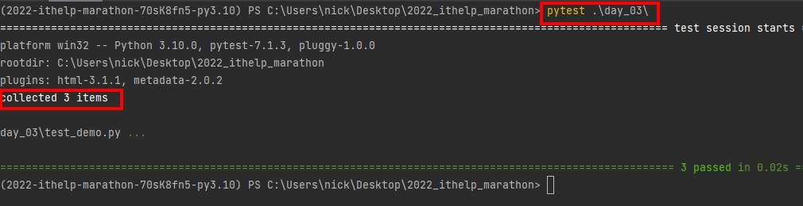
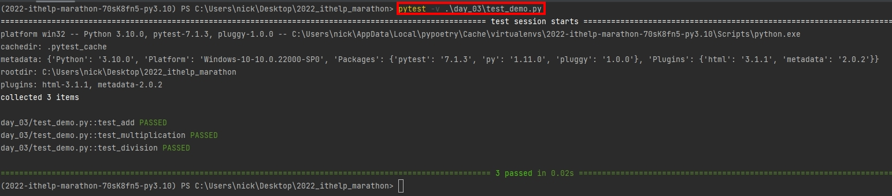
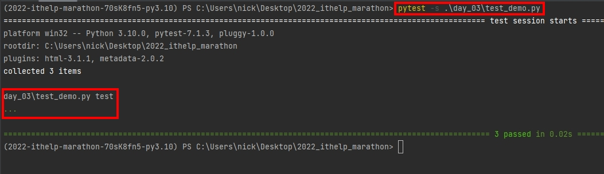
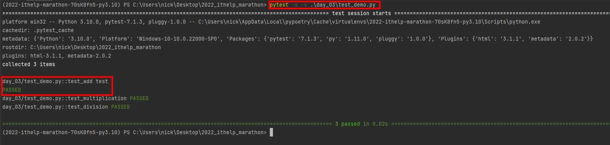

# Python 與自動化測試的敲門磚_Day03_Pytest 的執行與報表
每天的專案會同步到 github 上，可以前往 [這個網址](https://github.com/nickchen1998/2022_ithelp_marathon)
如果對於專案有興趣或是想討論一些問題，歡迎留言 OR 來信討論，信箱為：nickchen1998@gmail.com

今天我們會介紹該如何執行 pytest，分別會透過 IDE 以及 Terminal 兩種方式來執行，下方為本次會使用的 test case 的範例
- test_demo.py
```python
def test_add():
    assert 1 + 1 == 2


def test_multiplication():
    assert 2 * 2 == 4


def test_division():
    assert 25 / 5 == 5
```

## 一、使用 IDE 執行
如果你有在專案內安裝 pytest 的話，pycharm 會提供很方便的快捷鍵來讓你執行測試程式

### (一)、設定 Pycharm 的 test runner
在使用 Pycharm 進行測試前，我們得先確保預設的測試套件會使用 `pytest` 來進行測試，請依照下面的步驟進行設定
1. 點選左上 `File` 選項
2. 進入 `Settings`
3. 選擇 `Tools` 選項
4. 選擇 `Python Integrated Tools` 選項
5. 設置 Testing 底下的 `Default test runner` 為 pytest


### (二)、執行 test case
在設定完成後，Pycharm 便會自動判別函式名稱是否為 test 開頭，當你看到函是左方有 綠色三角形按鈕，表示 Pycharm
已經將這個函式視別為一個 test case 了



點選執行按鈕後，選擇第一個選項，Pycharm 便會開始執行指定的  test case，並於下方產出一份簡易的測試結果



### (三)、執行整個 test.py 檔案
若想利用 Pycharm 一次執行某個 .py 檔案內的所有 test case，我們只需要在該檔案內的空白處 (即不選取到任何函式的地方)
點選右鍵按下 `Run 'pytest in test_......'` 選項，即可一次執行整個 file 的 test case，下圖中可以看到測試結果內包含了三個 test case


## 二、使用 Terminal 執行
下面的範例所使用之 Terminal 為 Pycharm 內部提供的 Terminal，可依照環境選用自己習慣的 Terminal 進行操作

### (一)、確認環境
在使用 Terminal 執行時，首先要確保你的執行環境是否正確，如果你的專案有使用虛擬環境，請務必確保 Terminal 有進入虛擬環境
下面為使用 poetry 進入虛擬環境的示意



### (二)、簡易執行
語法：`pytest <.py 檔案位置>`

範例：`pytest .\day_03\test_demo.py`
可以看到下圖為利用上述指令執行的結果，pytest 會自動蒐集該檔案內的所有 test 開頭的函式做為 test case



當然我們也可以針對整個目錄去做執行，只要你的檔案開頭為 test 並且想要被執行的 test case 有使用 test 作為開頭
pytest 會自動的去辨識是否為 test case 並執行，因此利用下面的語法執行所得到的結果也會是相同的

範例：`pytest .\day_03\`




### (三)、參數執行
pytest 的執行參數百百種，下面列舉兩項比較常用的作為代表
1. `pytest -v <目錄 or 檔案位置>`：會列出每個 test case 的執行狀況

    範例：`pytest -v .\day_03\test_demo.py`

    

2. `pytest -s <目錄 or 檔案位置>`：會印出在 test case 內有 print 出來的數值
    
    - 我們先將 `test_add` 做修改
    ```python
    def test_add():
        print("test")
        assert 1 + 1 == 2
    ```
   
    - 範例：`pytest -s .\day_03\test_demo.py`
      
      

3. `pytest -s -v <目錄 or 檔案位置>`：不同的參數間，也可以進行混用，這邊進行簡單的範例展示

   可以看到下方圖片當中，印出了所有的 test case 名稱，並且也印出了 test_add 內的 "test" 字串
   
   - 範例：`pytest -s .\day_03\test_demo.py`
     

除了上面提到的兩個執行參數之外，可以參考一下 [這個網址]() 裡面有提供更多的功能可以使用，

## 三、內容預告
在硬體測試當中，時常會被主管要求產出測試報告，明天我們會教大家如何利用 pytest 本身的參數以及第三方套件來產出報告