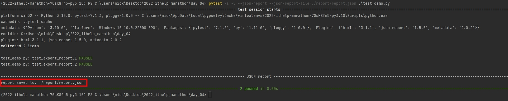
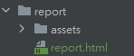
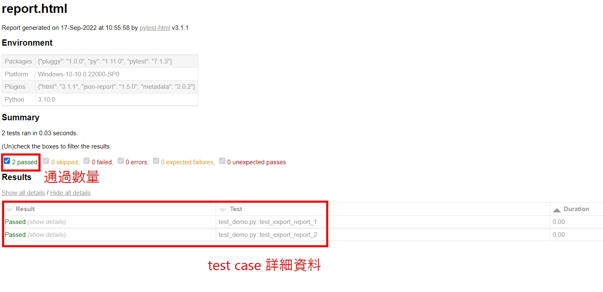

# Python 與自動化測試的敲門磚_Day04_Pytest 產出報表 (上)

每天的專案會同步到 github 上，可以前往 [這個網址](https://github.com/nickchen1998/2022_ithelp_marathon)
如果對於專案有興趣或是想討論一些問題，歡迎留言 OR 來信討論，信箱為：nickchen1998@gmail.com

筆者在大學實習期間，做的是硬體測試的相關工作，時常會被公司要求要對於測試的成果產出一份報表，今天我們會教大家，如何讓 pytest
搭配一些第三方套件進行報表的製作，分別會有 JSON、HTML 這兩種方式。

## 一、產出 JSON 格式報表

### (一)、test case 簡介

由於今天的重點是著重在產出測試簡報，因此 test case 不會撰寫得太複雜，下面為今天簡單的測試案例

```python
def test_export_report_1():
    a = 1 + 1
    b = 2 + 2

    assert b > a


def test_export_report_2():
    a = 2 + 2
    b = 4 + 4

    assert a < b
```

### (二)、安裝套件

要想產出 JSON 格式的報表，必須安裝 `pytest-json-report` 這個套件，可以虛擬環境不同利用下面的語法安裝

- venv

```bash
pip install pytest-json-report 
```

- poetry

```bash
poetry add pytest-json-report 
```

### (三)、套件使用

下面這個範例為一個最簡單的使用範例的語法結構解析與實際使用範例

- 結構解析：`pytest <pytest 原生參數 ex: -s -v> --json-report --json-report-file=<檔案名稱 or ./目錄位置/檔案名稱> <要執行的 .py 檔案 (可省略直接對整個目錄做讀取)>`
- 使用範例：`pytest -s -v --json-report --json-report-file=.\report\report.json .\test_demo.py`

下圖為使用上面的範例進行操作後終端機所產出的畫面，我們可以看到在最後有跳出提示 `report saved to: ...`
，表示報表已經成功產出，就可以前往指定目錄去察看報表了



### (四)、報表解析
這邊針對 JSON 格式的報表做一些簡單的解釋
- duration：本次測試執行所耗費的時間
- root：從哪個目錄下 pytest 指令的
- environment：一些環境的設定，例如 Python 版本
- summary：測試結果總攬，collected 的部份表示 pytest 從 root 開始往下蒐集到多少個 test case
- collectors：蒐集 test case 的過程
- tests：測試的詳細結果，包含 setup、teardown 和 test case 本身的執行過程、時間

P.S.：setup 和 teardown 為明天的內容，今天先不多做解釋
```json
{
  "created": 1663382369.6435244,
  "duration": 0.0156252384185791,
  "exitcode": 0,
  "root": "C:\\Users\\nick\\Desktop\\2022_ithelp_marathon\\day_04",
  "environment": {...},
  "summary": {
    "passed": 2,
    "total": 2,
    "collected": 2
  },
  "collectors": [...],
  "tests": [...]
}
```

## 二、產出 HTML 報表
這邊我們使用的 test case 就沿用 JSON 報表的部分，主要也是著重在報表的操作跟解析

### (一)、套件安裝
- venv
```bash
pip install pytest-html
```
- poetry
```bash
poetry add pytest-html 
```

### (二)、套件使用
- 語法結構：`pytest --html=<檔案名稱.html or .\目錄位置\檔案名稱.html> <執行的 .py 檔，省略會直接對整個目錄執行>`
- 使用範例：`pytest --html=.\report\report.html .\test_demo.py`

### (三)、報表解析
由於執行完成後不會跳出甚麼提示，我們就直接進入到報表解析的部分

- 目錄架構：可以看到在執行完成後會自動產出一個 .html 檔，並且會自動產出 assets 目錄用來存放 css 用的



- 報表展示



## 三、內容預告
今天我們介紹了如何用 pytest 產出 JSON 與 HTML 這兩種常用的檔案格式的報表，筆者這邊有找到一個很炫炮的產生報表的套件叫 Allure
不過由於他的安裝方式稍微複雜一些，因此明天會多花一天的篇幅來講如何進行安裝與程式的撰寫