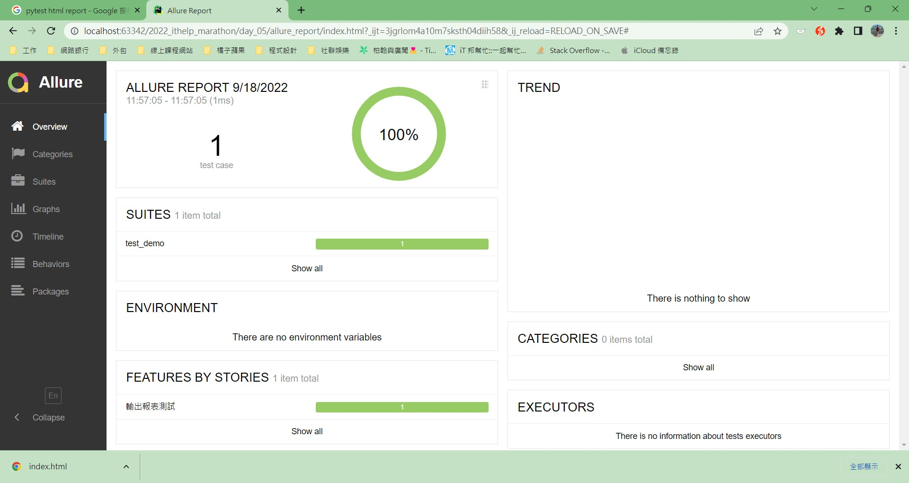
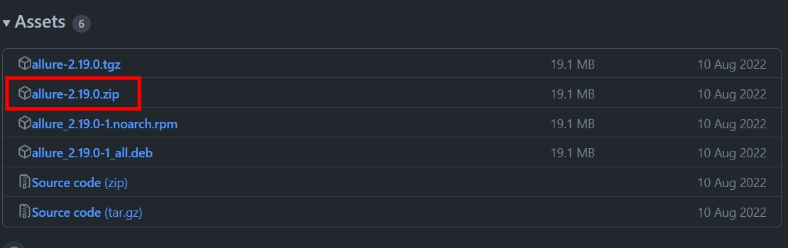
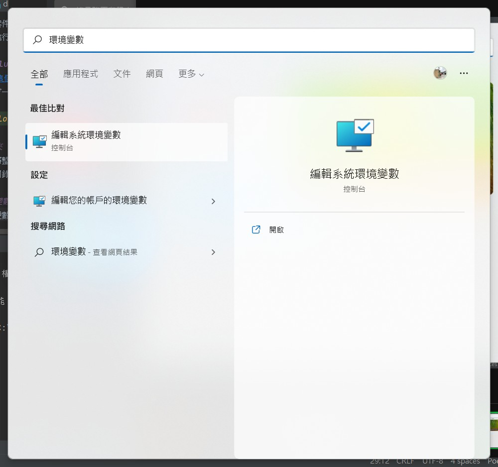
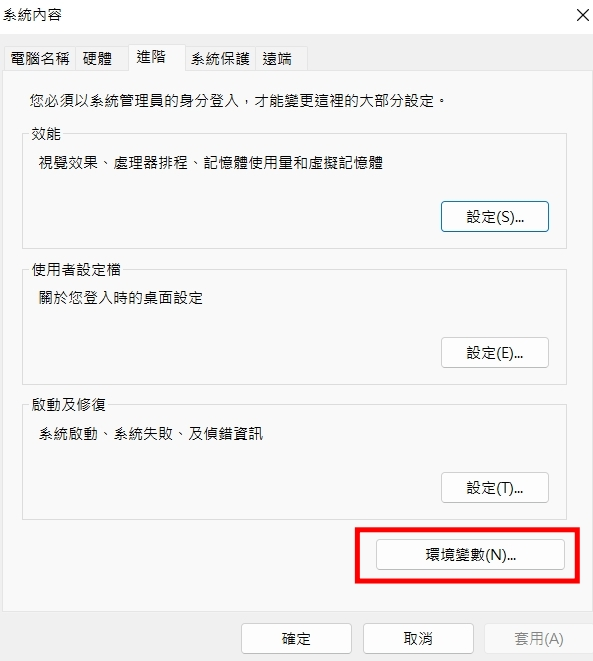
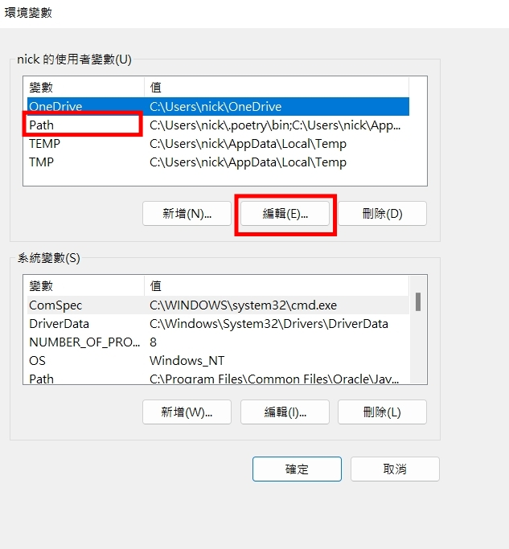
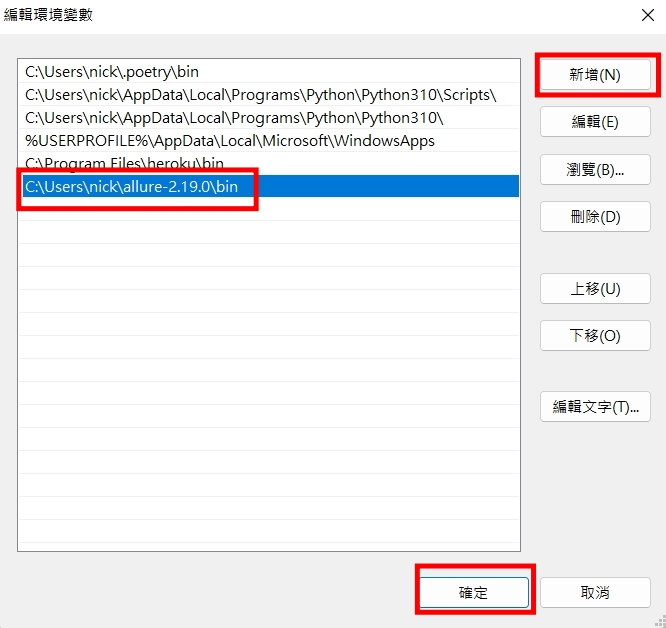
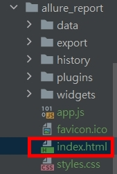

# Python 與自動化測試的敲門磚_Day05_Pytest 產出報表 (下)

每天的專案會同步到 github 上，可以前往 [這個網址](https://github.com/nickchen1998/2022_ithelp_marathon)
如果對於專案有興趣或是想討論一些問題，歡迎留言 OR 來信討論，信箱為：nickchen1998@gmail.com

昨天我們分享了如何用 pytest 產出兩種很基本格式的報表，對於一班情況來說基本上都夠用了，然而根據情況的不同，某些測試結果可能會直接上呈到很高階的主管
若是把昨天那種報表繳上去，想必只會被退回，碰到這種情況就可以使用 allure 來協助我們製作精美的報表　(如下圖)，下面會帶大家從零開始安裝



## 一、安裝 Java JDK
由於 Allure 運行似乎需要 Java JDK 來支持，因此在安裝 Allure 之前請先確保你的電腦上有任何一版本的 Java JDK，如果沒有的話
可以前往 [這個網址](https://www.oracle.com/java/technologies/downloads/) 進行下載，安裝過程基本上就是無腦按下一步直到安裝完成，
就不進行贅述

## 二、安裝 Allure
在開發環境中安裝的套件只會協助我們產生 Allure 的一些設定檔案，我們可以理解成會產出一些零件，真正要透過 Allure 生成一份報表的話，
我們還需要在本地端進行 Allure 的安裝來協助我們將這些零件拼裝成一份報表，下面為安裝的步驟

### (一)、下載 Allure
我們可以直接前往 [這個網址](https://github.com/allure-framework/allure2/releases) 下載最新 Release 版本的 Allure，
在每個版本下方都會有一個 Assets 部分，根據需求下載你要的壓縮檔，筆者這邊是下載 .zip 檔



## (二)、移動資料夾
解壓縮完成後，我們將整個資料夾移動到 `C:\Users\nick\allure-2.19.0` 這層目錄中，當然你也可以放在任何你想要的地方，
移動完成後我們將該目錄的位置複製下來

## (三)、設定環境變數
接著我們要設定環境變數，windows 的朋友我們可以利用搜尋直接打開設定環境變數的視窗，並點選 "環境變數" 選項




點選使用者環境變數區塊內的 `PATH` 欄位並點選編輯



點選新增並貼上剛剛所複製的路徑，並於尾端加上 `\bin`，因此完整路徑會長這樣 `C:\Users\nick\allure-2.19.0\bin`



完成後就一路按確定直到關閉整個環境變數設定視窗

### (四)、檢查是否安裝成功
打開 cmd 視窗並輸入 `allure --version`，有出現 allure 的版本號碼就代表安裝成功了

## 二、程式碼撰寫
講了這麼多終於要來寫程式了，不過在這之前，我們還是得在虛擬環境安裝相關的套件

### (一)、安裝套件
```bash
poetry add allure-pytest
```
or
```bash
pip install allure-pytest
```

### (二)、撰寫測試程式
下方的每一行程式碼後面會有簡單註解說明
```python
import allure


@allure.story("輸出報表測試")  # 調用裝飾器註明此 test case 會被 allure 輸出
def test_export_report():
    with allure.step("開始運算"):  # 利用 allure.step 建立測試步驟，表示該步驟測試開始
        a = 1 + 1
        print(f"a 的數值為 {a}")  # 印出一些資訊，會被印在 allure 產生出的報表上

        b = 2 + 2
        print(f"b 的數值為 {b}")

        assert b > a  # 進行驗證
```

### (三)、執行測試與生成報表
- 執行測試的語法結構：`pytest <測試檔案 or 目錄> --alluredir <allure 暫存檔存放位置>`
- 執行測試範例：`pytest .\test_demo.py --alluredir .\report\`
- 生成報表語法結構：`allure generate <allure 暫存檔存放位置> -o <輸出報表位置> --clean`
- 生成報表範例：allure generate .\report\ -o .\allure_report\ --clean

依序執行完上述兩個指令後 (先執行測試並產出暫存檔、再使用生成報表語法) 即可在 "輸出報表位置" 目錄內看到 allure 幫我們生成的一堆檔案，點選 'index.html' 即可查看報表



## 三、內容預告
今天教大家如何使用 allure 進行報表的生成了，當然 allure 裡面還有提供了更多的設定，可以使產出的報表更加精美，
可以多多參考 [官方文件]() 來進行學習，明天我們就會回歸 pytest 主體，教大家如何使用 setup、teardown 來讓我們的測試
更加快速方便