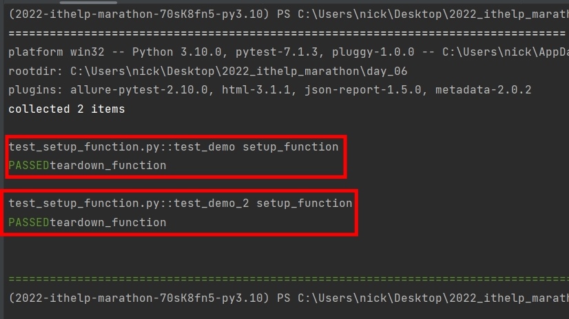
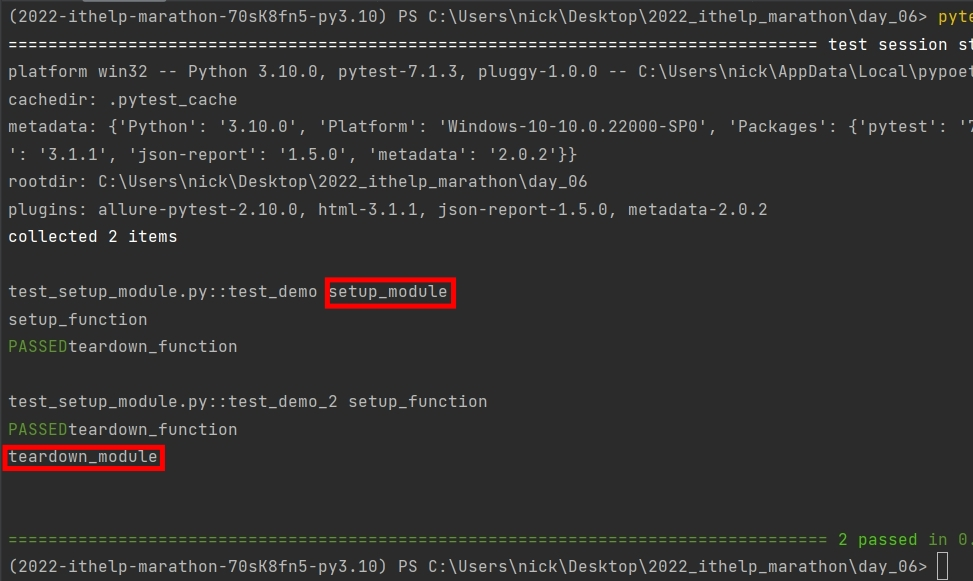
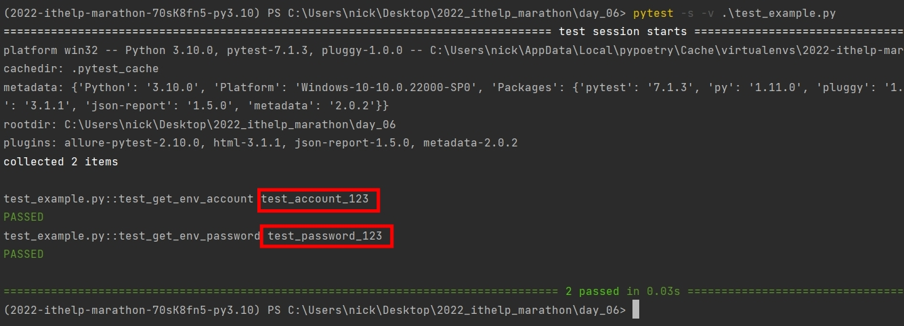

# Python 與自動化測試的敲門磚_Day06_Pytest 的 setup 和 teardown

每天的專案會同步到 github 上，可以前往 [這個網址](https://github.com/nickchen1998/2022_ithelp_marathon)
如果對於專案有興趣或是想討論一些問題，歡迎留言 OR 來信討論，信箱為：nickchen1998@gmail.com

setup 和 teardown，顧名思義，就是會在每次測試程式開始和結束時執行，通常用於環境設定，例如：建立資料庫資料表、建立 superuser ... 等等，
讓我們在單元測試的時候時候無須再額撰寫一次這些步驟，下面會分別介紹 function 等級、module 等級以及實際撰寫一個使用範例

## 一、function 等級
### (一)、範例
在 function 等級設定 setup、teardown 時，會於每個 function 的開始以及結束時都會執行一次，
下面為使用範例

在定義 setup_function 與 teardown_function 時，請勿必確認函式名稱要完全吻合，pytest 會自動抓取在同個檔案當中是否有
相關名稱的函式，並自動執行 setup 與 teardown

```python
def setup_function():
    print("setup_function")


def teardown_function():
    print("teardown_function")


def test_demo():
    assert 1 + 1 == 2


def test_demo_2():
    assert 2 + 2 == 4
```

### (二)、執行結果
在下圖中我們可以看到在兩個 test case 當中都分別印出了 setup_function、teardown_function 的字串



## 二、module 等級
### (一)、範例
顧名思義，module 等級就是在整個 module 當中只會執行一次，而在 python 當中，每一個 .py 檔就代表一個 module

可以看到下面的範例有加上 setup_module 以及 teardown_module，同理，若想使用此方法，也請務必要確認函式的名稱必須完全一致，
pytest 會自動去蒐集是否有相關名稱的函式
```python
def setup_module():
    print("setup_module")


def teardown_module():
    print("teardown_module")


def setup_function():
    print("setup_function")


def teardown_function():
    print("teardown_function")


def test_demo():
    assert 1 + 1 == 2


def test_demo_2():
    assert 2 + 2 == 4
```

### (二)、執行結果
下圖中我們可以看到，於 setup_module 以及 teardown_module 的訊息只有印出一次，而 function 等級的訊息則印出了兩次




## 三、使用範例
接下來我們會用 module 等級的方式撰寫一份簡單的使用範例

### (一)、建立 .env 檔案
env 檔案當中時常會保留我們不想要進入版本控制的重要資訊，例如：帳號、密碼、資料庫網址等
我們可以透過 module 等級的方式於測試開始前執行一次，來取得 env 裡面的內容

注意： github 上的專案並沒有把 .env 推上去，若想使用請自行建立
```
ACCOUNT="test_account_123"
PASSWORD="test_password_123"
```

### (二)、撰寫測試程式
注意：範例中用來讀取 .env 檔的 dotenv 套件為額外裝的，套件名稱為 `python-dotenv`
```python
import os
import dotenv


def setup_module():
    dotenv.load_dotenv("./.env")


def test_get_env_account():
    print(os.getenv("ACCOUNT"))


def test_get_env_password():
    print(os.getenv("PASSWORD"))
```

### (三)、執行結果
下圖中我們可以看到我們有成功地讓兩個 test case 分別讀到 account 和 password 並印出，
至於為什麼不用 function 等級的方式執行，是因為 .env 檔案通常只需要在開始時執行一次，就會被載入，
使用者可以根據不同的使用情境可以自己判斷該用什麼等級的 setup 和 teardown



## 四、內容預告
今天我們介紹了該如何使用 setup 和 teardown 來為每一個測試案例作環境的初始化以及收尾，明天我們會介紹一個有點類似的東西
叫做 fixture 他同樣也可以做到環境的設定，不過它可以將設定完成後的東西以參數的型態回傳出來
