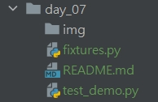

# Python 與自動化測試的敲門磚_Day07_Pytest 與 Fixture

每天的專案會同步到 github 上，可以前往 [這個網址](https://github.com/nickchen1998/2022_ithelp_marathon)
如果對於專案有興趣或是想討論一些問題，歡迎留言 OR 來信討論，信箱為：nickchen1998@gmail.com

昨天有提到在 pytest 當中有一個叫做 fixture 的功能，可以做到類似 setup、teardown 的功能，
fixture 和他們最大的差別在於，fixture 可以參數化，並且可以回傳出參數提供其他 test case 做使用，
今天我們就來好好介紹他

## 一、fixture 快速入門
### (一)、目錄架構
在開始撰寫之前，先介紹一下本次的目錄架構，由於不想造成程式碼太過混亂，fixture 的部分會存放在 fixtures.py 當中，
要使用的時候再使用 import 進來進行使用，而各個 test case 則是寫在 test_demo.py 當中



### (二)、快速建立 fixture
首先我們同樣在同層目錄下建立 .env 檔案用來做範例使用，內容如下
- .env
```bash
ACCOUNT="test_account"
PASSWORD="test_password"
```

接著開始進行 fixture 的撰寫
- fixtures.py

    在下面的程式碼當中，我們可以看到 fixture 是利用裝飾器的方式進行撰寫的，接著我們簡單介紹一下個參數的用途
    
    - scope：表示作用域，預設為 "function"，亦即每個有用到此 fixture 的 test case 都會執行，另外還有 module、class 以及 session 三種
    - name：用來設定 fixture 的別名，預設為函式名稱
    - autouse：預設為 False，若為 True，則會自動進行使用 (根據 scope 作用域而定)
```python
import pytest
from dotenv import load_dotenv


@pytest.fixture(scope="function", name="init", autouse=False)
def load_env():
    load_dotenv("./.env")
```

### (三)、使用 fixture

