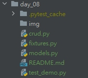
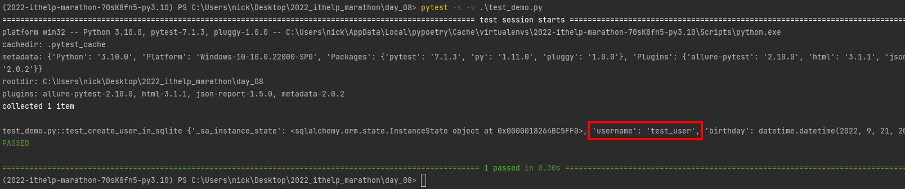

# Python 與自動化測試的敲門磚_Day08_Pytest 與 In-memory SQLite

每天的專案會同步到 github 上，可以前往 [這個網址](https://github.com/nickchen1998/2022_ithelp_marathon)
如果對於專案有興趣或是想討論一些問題，歡迎留言 OR 來信討論，信箱為：nickchen1998@gmail.com

接下來兩天我們要來介紹兩種虛擬資料庫，虛擬的資料庫可以讓我們在測試的時候可以在不實際建立資料庫環境的前提下，進行資料庫 CRUD 的函式測試，
接下來兩天會分別會針對 SQL & NoSQL 各介紹一種，而今天我們先介紹 SQL 陣營的虛擬資料庫 - In-memory SQLite

## 一、專案架構介紹
由於今天的專案會比較符合真正在撰寫測試的情境，因此檔案稍微多了一些，另外今天會使用到 sqlalchemy 這個操作關聯式資料庫的套件，
有興趣的人可以到我之前寫的文章看看，今天就把重點放在測試的部份上，下方為本次的專案架構截圖



- crud.py：存放對資料庫做 CRUD 操作的函式
- fixtures.py：存放使用 pytest 製作出的 fixture
- models.py：存放 sqlalchemy 建立的 ORM 架構
- test_demo.py：存放 test case

## 二、虛擬關聯式資料庫 SQLite
### (一)、資料庫路徑
有使用過 sqlalchemy 或 sqlmodel 的人，想必對於下方的路徑會很熟悉，這個是用在將資料庫與 ORM 架構做連線時的資料庫位置
```bash
mysql+pymysql://<username>:<password>@<host>:<port>/<database_name>
```

而今天要介紹的虛擬關聯式資料庫，是使用 SQLite 所提供的 In-memory 的資料庫，使用的路徑非常簡單，如下所示
```bash
sqlite://
```
且由於 python 內自帶 sqlite 的套件，所以只要將上面的路徑放入資料庫連線的路徑，電腦就會動使用記憶體協助我們進行資料表的建立以及操作

### (二)、建立測試內容
這邊我們會先簡單介紹放在 models 的內容以及要被測試的 CRUD 的函式

- models.py
  - 建立一張名為 User 的資料表並且有 id 、 username 以及 birthday 三個欄位
```python
from sqlalchemy.ext.declarative import declarative_base
from sqlalchemy import String, Column, Integer, DATETIME
from datetime import datetime

Base = declarative_base()


class User(Base):
    __tablename__ = "user"
    id: int = Column(Integer, primary_key=True, autoincrement=True)
    username: str = Column(String(64))
    birthday: datetime = Column(DATETIME)
```

- crud.py
  - 建立一個可以利用 sqlalchemy 寫入資料的 function
```python
from sqlalchemy.orm import Session
from models import User


def create_user_in_sqlite(data: User, session: Session) -> User:
    session.add(data)
    session.commit()
    session.refresh(data)

    return data
```

### (三)、建立 fixture
接下來就是重點了，sqlalchemy 實際對資料庫進行操作的時後，需要一個 session 物件來協助我們進行操作，
接下來我們就要利用 fixture 來替我們在測試前做建立資料表以及產生一個 session 的動作

程式解析：
- 利用剛剛所介紹的方法，先建立一個 engine 並與虛擬的 sqlite 進行連線
- 在測試之前我們先利用 fixture 替我們將資料表建立好，這樣在測試的過程中就不需要再花時間在撰寫建立環境的部分
- 接著我們實際建立一個 session 並 yield 出去
  - 使用 yield 的原因是，當 test case 結束後，就會回到 fixture 內執行接下來的動作
  - 由於式使用 with 進行 session 的建立，因此也 test case 結束後回到 fixture 內，此 session 會自動關閉
- 最後 test case 結束會到 fixture 內將資料表全部刪除，確保下一個 test case 有乾淨的環境做測試
```python
import pytest
from sqlalchemy import create_engine
from sqlalchemy.orm import Session, sessionmaker
from models import Base


@pytest.fixture(name="sqlite_session")
def sqlite_session_fixture() -> Session:
    # 建立 engine
    engine_url = "sqlite://"
    engine = create_engine(engine_url)

    # 建立資料表
    Base.metadata.create_all(engine)

    #  yield 出 Session
    with sessionmaker(bind=engine)() as session:
        yield session

    # 刪除資料表
    Base.metadata.drop_all(engine)
```

### (三)、建立測試程式
接下來就來就準備撰寫 test case 了，一樣附上程式碼並逐行解釋

程式解析：
- 將所使用到的套件分別進行 import
- 建立 test case 並使用 fixture sqlite_session 並提示 IDE 此為一個 Session 型態的參數
- 利用 User 建立一個測試資料
- 利用 crud 內的函式對資料庫測式寫入
- 驗證寫入函式回傳出的 username 是否和我們手動建立的 username 是否一致
```python
from crud import create_user_in_sqlite
from models import User
from fixtures import sqlite_session_fixture
from sqlalchemy.orm import Session
from datetime import datetime

use_fixtures = [sqlite_session_fixture]


def test_create_user_in_sqlite(sqlite_session: Session):
    data = User(username="test_user", birthday=datetime.now())

    result: User = create_user_in_sqlite(data=data, session=sqlite_session)
    print(result.__dict__)

    assert result.username == data.username
```

### (四)、成果展示
接著我們就可以利用 pytest 對 test_demo.py 進行測試了，下方為測試結果截圖


## 三、內容預告
今天我們介紹了虛擬的 SQLite 資料庫，這個資料庫基本上可以兼容大多數的關聯式資料庫，但還是有特例，例如：postgres 當中的 Array 欄位
無法使用在 SQLite 當中，因此使用相關的功能時就會產生錯誤，這個時候可能就還是得利用 docker 建立一個測試用的資料庫才可以進行測試，
不過原本就是使用 mysql 或式 sqlite 的朋友，就完全不用擔心這個問題了

明天我們會介紹無關連式資料庫 (NoSQL) 陣營的虛擬資料庫 - MongoMock