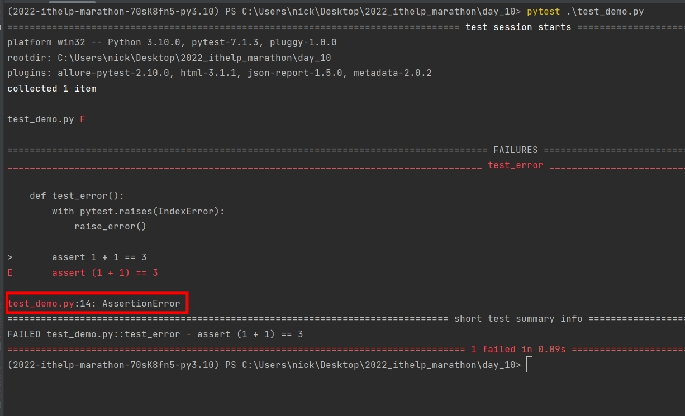
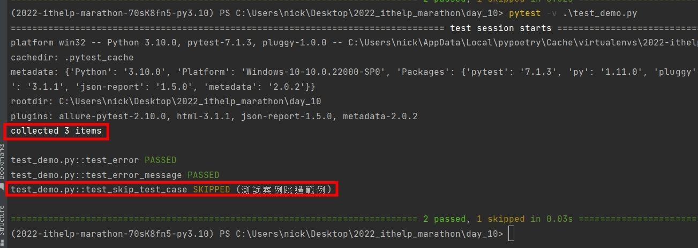
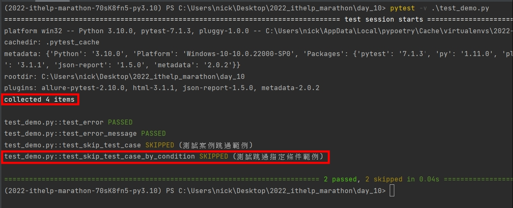

# Python 與自動化測試的敲門磚_Day10_Pytest 驗證錯誤與跳過案例

每天的專案會同步到 github 上，可以前往 [這個網址](https://github.com/nickchen1998/2022_ithelp_marathon) 如果對於專案有興趣或是想討論一些問題，歡迎留言 OR 來信討論，信箱為：nickchen1998@gmail.com

今天我們要來介紹如何在 pytest 中驗證 "預期內" 的錯誤，以及該如何跳過暫時不想測試的 test case

## 一、驗證錯誤
在撰寫程式的時候，常常會有一些預期內的錯誤，尤其是在開發 API 的時候時常會人工引發一些錯誤，像是使用者輸入密碼錯誤時、
資料驗證格式錯誤時，這些就屬於 "預期內" 的錯誤，是合理的錯誤，並非程式本身造成的，像這類的錯誤 pytest 也有提供驗證錯誤
的功能來協助我們進行測試

### (一)、驗證錯誤
程式解析：
- 建立 raise_error 函式來手動引發一個錯誤
- 於 test_error 內使用 pytest.raises(IndexError) 來驗證函式引發的錯誤種類是否如預期

```python
import pytest


def raise_error():
    raise IndexError("list 的位置錯誤")


def test_error():
    with pytest.raises(IndexError):
        raise_error()
```

注意：經筆者測試，在 pytest 驗證到預期內的錯誤訊息後，無法在同個 with 區域內進行其他驗證，都會顯示正確，若有需要驗證其他錯誤 or 案例，則需另開一個 with，或是將程式寫在 with 外部

如下方程式所示，手動驗證一個錯誤的條件需要寫在接收到預期錯誤的 with 區域之外，才會被檢查到錯誤
```python
def test_error():
    with pytest.raises(IndexError):
        raise_error()

    assert 1 + 1 == 3
```



### (二)、驗證錯誤訊息
`pytest.raises()` 除了在接收到預期內的錯誤不會報錯之外，我們也可以針對錯誤訊息的內容進行驗證


程式解析：
- `with pytest.raises(IndexError) as exc` 我們可以理解成把接收到的錯誤丟給一個叫做 exc 的變數，並於外部做使用
- 驗證錯誤訊息的內容
- 驗證錯誤訊息的 class name
```python
def test_error_message():
    # 將接收到的錯誤丟給一個名為 exc 的變數，該變數可於外部使用
    with pytest.raises(IndexError) as exc:
        raise_error()
    
    # 印出錯誤訊息內容並驗證
    print(str(exc.value))
    assert str(exc.value) == "list 的位置錯誤"
    
    # 印出錯誤訊息類別並驗證
    print(str(exc.typename))
    assert exc.typename == IndexError.__name__
```

## 二、跳過 test case
某些情況下，我們可能會不想讓一些 test case 被執行，比方說某個 function 只能用在某個版本的時候，或是在某種作業系統上該函式使用的套件會失效，又或是暫時不想刪除，
碰到這類的情況 pytest 有提供了跳過的功能，分別為 skip 和 skipif

為了測試方便，我們會將接下來的兩個範例連同上面所撰寫的兩個 test case 一起執行，並且觀察 pytest 收集到的 test case 數量

### (一)、直接跳過 skip
程式解析：
- 利用 `@pytest.mark.skip()` 裝飾器的方式來標註該案例需要跳過
- reason 則是用來撰寫跳過的原因，該原因會被印在 terminal 上
```python
@pytest.mark.skip(reason="測試案例跳過範例")
def test_skip_test_case():
    assert 1 + 1 == 3
```

結果展示：

可以看到下方圖片中，pytest 有成功蒐集到三個 test case，而第三個 test case 狀態為 `SKIPPED` 並且原因印出於狀態後方


### (二)、有條件跳過 skipif
我們可以透過指定 sys 內的條件來進行跳過，下方的範例就是讀取目前的作業系統，如果為 "win32" 就不執行此範例
```python
import sys


@pytest.mark.skipif(condition=sys.platform == "win32", reason="測試跳過指定條件範例")
def test_skip_test_case_by_condition():
    assert 1 + 1 == 4
```


另外我們可以透過印出 sys 內的物件及屬性，來查看有哪些條件可以支援
```python
print(dir(sys))
```

## 三、內容預告
今天介紹了驗證錯誤與跳過 test case 的方法，雖然感覺都是依些比較零碎的方法，但實際上在撰寫測試程式的時候根據情況的不同，還是會很常用到，
明天我們會介紹 mark.parametrize 利用參數化的方式觸發 pytest，簡單來說就是依照不同的情況一次塞很多測試資料對一個測試案例進行測試的方式