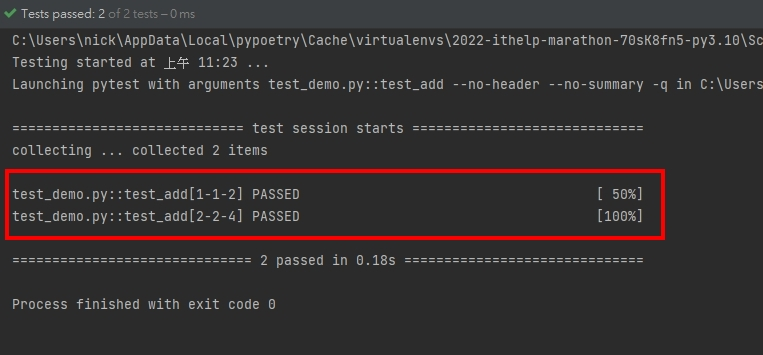
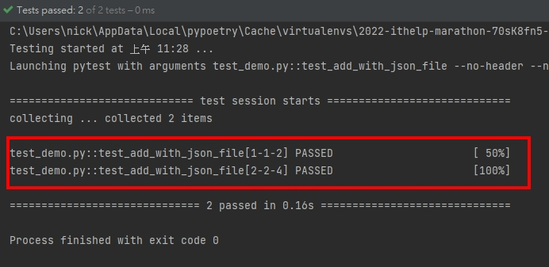
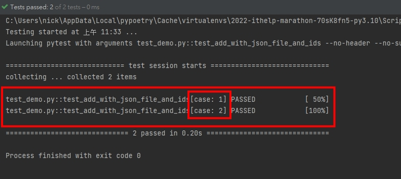

# Python 與自動化測試的敲門磚_Day11_Pytest 與 parametrize

每天的專案會同步到 github 上，可以前往 [這個網址](https://github.com/nickchen1998/2022_ithelp_marathon) 如果對於專案有興趣或是想討論一些問題，歡迎留言 OR 來信討論，信箱為：nickchen1998@gmail.com

今天我們要介紹如何利用 pytest 提供的 parametrize 來自動生成多筆測試，這個方式通常用於硬體的測試，需要使用很多不同的數值來對某個功能做測試，
例如：USB 寫入速度跟寫入的檔案大小，但測試的 function 其實是一樣的，像這種情況我們就不需要撰寫多個 test case，利用 parametrize 的方式來進行測試即可

##  一、簡單範例
下面我們直接上範例來進行解釋

程式解析：
- 利用裝飾器的方式來進行 parametrize 的撰寫
  - argnames 為一組字串，分別要對應到 test case 內所需接收的參數
    - 注意：請不要將格式寫成　'num1', 'num2'... 應該將所有名稱包在同一組字串內，如　'num1, num2, ...'
  - argvalues 用一個串列包起來並將每一組測試資料也用一個串列包起來，形成一個二維串列
```python
import pytest


# 基本範例
@pytest.mark.parametrize(argnames='num1, num2, result', argvalues=[(1, 1, 2), (2, 2, 4)])
def test_add(num1: int, num2: int, result: int):
    assert num1 + num2 == result
```

測試結果：

可以看到下圖中我們只執行了 test_add 這個 test case，但測試的項目卻成功地產生出兩個


## 二、搭配檔案讀取
除此之外，我們也可以將多組測試參數寫進檔案中，在測試之前先讀取進 python 中，於裝飾器內再指派給 test case

- test_args.json
```json
{"test_add": [[1, 1, 2], [2, 2, 4]]}
```

- test_demo.py
```python
import json
import pytest


# 搭配檔案讀取
with open("./test_args.json", "r", encoding="utf8") as file:
    test_args = json.loads(file.read())['test_add']


@pytest.mark.parametrize(argnames='num1, num2, result', argvalues=test_args)
def test_add_with_json_file(num1: int, num2: int, result: int):
    assert num1 + num2 == result
```

下圖中我們可以看到同樣成功生成了兩個測試


## 三、ids 的使用
如果同時生成許多組測試，可能會造成閱讀上的不易，這時候我們可以透過 ids 來為每一組測試提供名稱

這邊我們會沿用上方讀取 json 後產生的 test_args，並手動根據 test_args 的長度來建立相關的 id，
當然 ids 也可以利用讀取檔案的方式讀取近來，只要數量符合測試資料筆數，且型態為 list 即可
```python
# ids 的使用
ids = [f"case: {i}" for i in range(1, len(test_args) + 1)]


@pytest.mark.parametrize(argnames='num1, num2, result', argvalues=test_args, ids=ids)
def test_add_with_json_file_and_ids(num1: int, num2: int, result: int):
    assert num1 + num2 == result
```

下圖中我們可以看到 pytest 成功為我們的每組測試都加上名稱



## 四、搭配 fixture 做使用
網路上有很多 fixture 搭配 parametrize 的使用方式，不過筆者試了一下，發現 fixture 其實可以很直覺的 import 進來直接使用，請看下面範例

- fixtures.py

建立一個 fixture 用來展示用
```python
import pytest
from mongomock.mongo_client import MongoClient


@pytest.fixture(name="conn")
def mongo_client_fixture() -> MongoClient:
    with MongoClient() as conn:
        yield conn


```
- test_demo.py

可以看到在這個 test case 當中，直接將 import 進來的 fixture name 打在 test case 最後面的參數，即可進行使用，請務必將 fixture 放在最尾端避免造成額外的錯誤

為了驗證是否真的有被 import 近來，第二個 assert 的部分為驗證 conn 參數是否為 MongoClient 型態，而非 None
```python
from fixtures import mongo_client_fixture
from mongomock.mongo_client import MongoClient

use_fixtures = [mongo_client_fixture]


# 搭配 fixture 使用
@pytest.mark.parametrize(argnames='num1, num2, result', argvalues=[(1, 1, 2), (2, 2, 4)])
def test_add_with_fixtures(num1: int, num2: int, result: int, conn: MongoClient):
    assert num1 + num2 == result
    assert isinstance(conn, MongoClient)
```

## 五、內容預告
今天我們介紹了如何參數化的執行 test case，讓測試案例更加活用，明天我們就會進入到 pytest 的最後一個環節，會教大家如何撰寫 pytest 的設定檔，
讓我們的測試程式更加的客製化