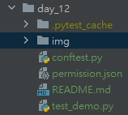
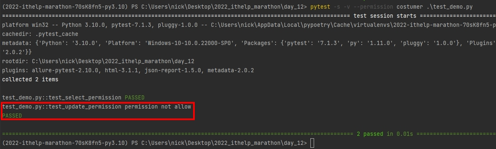
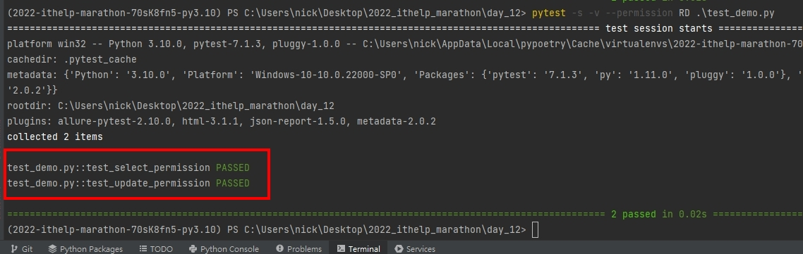

# Python 與自動化測試的敲門磚_Day12_Pytest 與 conftest.py

每天的專案會同步到 github 上，可以前往 [這個網址](https://github.com/nickchen1998/2022_ithelp_marathon) 如果對於專案有興趣或是想討論一些問題，歡迎留言 OR 來信討論，信箱為：nickchen1998@gmail.com

## 一、conftest.py 簡介
白話來說 conftest.py 就是一個可以讓我們存放 "經常被使用到" 的 fixture 的地方，被存放在 conftest.py 當中的 fixture 不需要透過 import
就可以直接進行使用，pytest 在一開始執行時，就會先去抓是否有 conftest.py 的存在，因此若今天發現你的 fixture 被許多個 test module 使用到的話
不彷可以試著將 fixture 放到 conftest.py 當中

順帶一提 conftest.py 的有效範圍是從 conftest.py 所存在的當前目錄以及其所有子目路中的 test case 都可以使用，若於不同目錄則需要另外寫一個 conftest.py

在本次的範例當中，會利用新增 pytest cmd argument 的方式來進行範例展示，下方附上本次專案目錄的結構


## 二、範例展示
### (一)、建立 conftest.py
- conftest.py
  - pytest_addoption 為 pytest 內建的 fixture，可以自定使用 cmd 執行時的參數
  - 建立一個名為 permission 的參數，用來識別權限
  - 建立 permission_fixture 用來讀取權限檔案，來識別使用者可以測試的範圍
```python
import json
import pytest


def pytest_addoption(parser):
    parser.addoption("--permission", default="RD")


@pytest.fixture(name="permission")
def permission_fixture(pytestconfig):
    role = pytestconfig.getoption("permission")
    with open("./permission.json", "r") as file:
        permission_data = json.loads(file.read())
    if role == "RD":
        permission = permission_data["RD"]
    else:
        permission = permission_data["costumer"]

    return permission
```

### (二)、建立 json 檔用來控制權限
- permission.json
  - 如果角色是 RD，則可以進行 select、update、delete
  - 其餘的則定位為 costumer，只能進行 select 的測試
```json
{
  "RD": [
    "select",
    "update",
    "delete"
  ],
  "costumer": [
    "select"
  ]
}
```

### (三)、撰寫 test case
- test_demo.py
  - 大家可以發現，這裡使用 permission 這個 fixture 的時候並沒有像之前一樣進行 import 可以直接使用
  - 分別有 select、update 兩項測試，並且於測試之前會進行權限的驗證
  - 於 test_update_permission 的時候，若權限不足則會引發錯誤，並驗證錯誤訊息
```python
import pytest


def test_select_permission(permission: list):
    if "select" in permission:
        assert True
    else:
        assert False


def test_update_permission(permission: list):
    if "update" in permission:
        assert True
    else:
        with pytest.raises(ValueError) as exc:
            raise ValueError("permission not allow")

        print(str(exc.value))
        assert str(exc.value) == "permission not allow"
```

### (四)、結果展示
- 啟動 pytest 指令:
```bash
pytest -s -v --permission costumer .\test_demo.py
```
可以看到當 permission 為 costumer 時，成功地引發了錯誤並通過錯誤訊息的驗證



```bash
pytest -s -v --permission RD .\test_demo.py
```
當權限為 RD 時，則 update 的部分不會引發錯誤


## 三、總結
上面使用了控制權限這個情境來展示 conftest.py 的應用，最後我們來總結一下，conftest.py 大致上應用的原則就是當 fixture 需要同時給予很多 test case 使用時，
才需要將 fixture 放到 conftest.py 當中，如果是只有某些項目需要使用到的 fixture 的話，筆者還是建議可以另外開一個 fixtures 來進行存放會比較好，
才比較符合 conftest.py 的定位

## 四、內容預告
pytest 的部份我們就講解到今天為止，明天開始我們會花大約兩天的時間來進行 TDD 開發模式的講解，以及實際利用此方式撰寫一個簡單的小程式