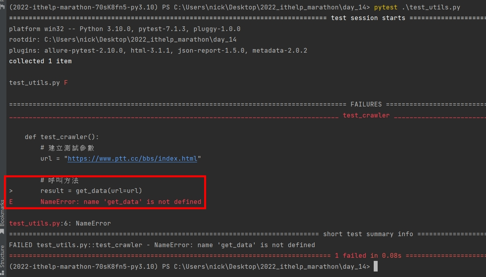
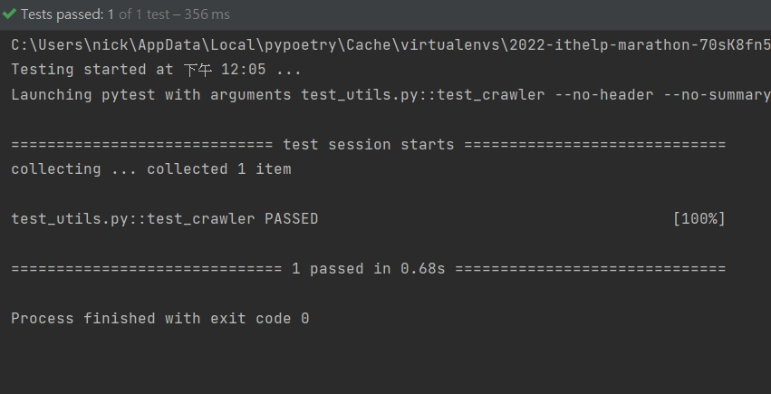
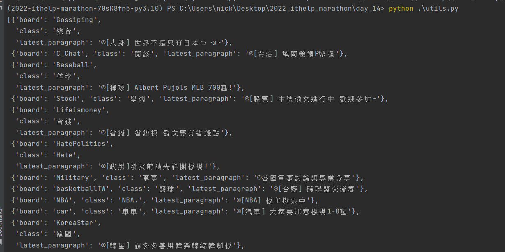

# Python 與自動化測試的敲門磚_Day14_TDD 開發流程與實做

每天的專案會同步到 github 上，可以前往 [這個網址](https://github.com/nickchen1998/2022_ithelp_marathon) 如果對於專案有興趣或是想討論一些問題，歡迎留言 OR 來信討論，信箱為：nickchen1998@gmail.com

昨天我們介紹了 TDD 的概念跟實做步驟，今天我們要來自己定義一個簡單的需求，並且按照 TDD 的方式來進行開發，
為了避免文章篇幅太長，因此盡量精簡化需求設定

## 一、需求設定
- 建立一個爬蟲針對 [ptt 熱門看板](https://www.ptt.cc/bbs/index.html) 進行爬取
- 每執行一次爬蟲腳本，會進行爬取並印出各個版名稱、分類以及最新文章

## 二、爬蟲部分開發
### (一)、需求思考
- 需要一個 url 參數，來進行網址的請求
- 回傳格式為 list，每個版資料使用 dictionary 裝起來
- 需要驗證項目：
  - list 不可為空
  - 每個 dictionary 內需要有 board、class 以及 latest_paragraph

### (二)、程式開發
#### 1. 撰寫測試程式
可以看到我們在這個步驟憑空撰寫了一個 get_data 的 function 但是實際上並沒有進行任何的 import

- test_utils.py
```python
def test_crawler():
    # 建立測試參數
    url = "https://www.ptt.cc/bbs/index.html"
    
    # 呼叫方法
    result = get_data(url=url)

    # 進行驗證
    assert result
    for data in result:
        assert data.get("board")
        assert data.get("class")
        assert data.get("latest_paragraph")
```

#### 2. 執行測試 (亮紅燈)
接著我們要執行測試，此步驟需要確認錯誤的位置必須在 get_data() 的部分，因為我們還沒有實際撰寫此 function

下圖中我們可以確認，發生錯誤的原因確實是因為沒有此 function


#### 3. 建立 function
- utils.py
在這個步驟當中，我們實際撰寫了一個爬蟲的 function 並命名為 get_data
```python
import requests
from bs4 import BeautifulSoup


def get_data(url: str) -> list:
    res = requests.get(url=url)
    if res.status_code == 200:
        soup = BeautifulSoup(res.text, "lxml")

        result = []
        targets = soup.find_all("div", class_="b-ent")
        for target in targets:
            tmp = {"board": target.find("div", class_="board-name").text,
                   "class": target.find("div", class_="board-class").text,
                   "latest_paragraph": target.find("div", class_="board-title").text}
            result.append(tmp)

        return result
```

#### 4. 進行測試 (亮綠燈)
接著我們要開始進行測試，於測試程式內實際將 get_data 進行 import 並測試調整直到亮綠燈

- test_utils.py
```python
from utils import get_data


def test_crawler():
    # 建立測試參數
    url = "https://www.ptt.cc/bbs/index.html"

    # 呼叫方法
    result = get_data(url=url)

    # 進行驗證
    assert result
    for data in result:
        assert data.get("board")
        assert data.get("class")
        assert data.get("latest_paragraph")
```

下圖中可以看到我們很幸運的一次就成功了，代表可以進入下個步驟


#### 5. 程式碼優化
在這個過程中，我們就可以開始針對程式碼進行重構，切記，每進行一次重構，就要執行一次對應的 test case
確保每次的異動不會造成 function 異常

由於需求提到需要印出，因此於這個步驟我們替 get_data 加上 print 讓需求完善，並建立腳本進入點
```python
import requests
from bs4 import BeautifulSoup
from pprint import pprint


def get_data(url: str) -> list:
    res = requests.get(url=url)
    if res.status_code == 200:
        soup = BeautifulSoup(res.text, "lxml")

        result = []
        targets = soup.find_all("div", class_="b-ent")
        for target in targets:
            tmp = {"board": target.find("div", class_="board-name").text,
                   "class": target.find("div", class_="board-class").text,
                   "latest_paragraph": target.find("div", class_="board-title").text}
            result.append(tmp)

        pprint(result)  # pprint 用於自動排版輸出
        return result


if __name__ == '__main__':
    get_data(url="https://www.ptt.cc/bbs/index.html")
```

下圖為利用 cmd 執行的結果


## 三、內容預告
今天我們簡單的使用 TDD 的方式來簡單建立一個小爬蟲腳本，明天開始我們會介紹 selenium 這個工具，
目前市面上經常被用來做爬蟲的工具，實際上本業是自動化測試的工具，讓我們花點時間來介紹他該如何使用以及讓他回歸本業吧