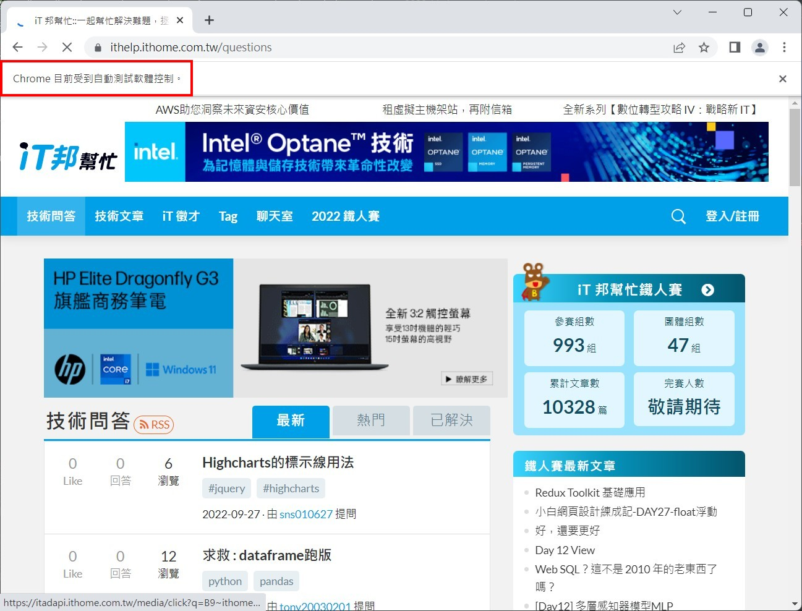

# Python 與自動化測試的敲門磚_Day15_Selenium 快速入門

每天的專案會同步到 github 上，可以前往 [這個網址](https://github.com/nickchen1998/2022_ithelp_marathon) 如果對於專案有興趣或是想討論一些問題，歡迎留言 OR 來信討論，信箱為：nickchen1998@gmail.com

今天開始我們要來介紹 Selenium，想有接觸過爬蟲的朋友們對這個工具一定很熟悉，我們可以透過 Selenium 來協助我們模擬出一個真實的瀏覽器，
並對網頁進行操作，在這個過程中，我們可以取得利用其他套件渲染的頁面的 html tag 進一步取得爬蟲所需要爬到的資訊，然而，Selenium 一開始問世時，
其實是拿來做自動化測試用的，只是其可以取得資訊的這個特性，剛好適合爬蟲的工作，因此也被拿來做為爬蟲的一種工具

接下來我們會花大約六天的時間停留在 selenium 上，前三天主要會講解 selenium 的入門資訊，例如：元素定位、瀏覽器操作方式等等，後三天我們會教學
selenium 該如何進行測試、錄製腳本等等和測試相關的內容

## 一、套件安裝
首先我們需要安裝兩個套件，分別是：
- selenium：用來建立模擬器
- webdriver_manager：用來協助我們做驅動程式的安裝，可以無需實際下載瀏覽器的驅動程式

```bash
poetry add selenium
poetry add webdriver_manager
```
or
```bash
pip install selenium
pip install webdriver_manager
```

## 二、快速入門
程式解析：
- 透過 make_webdriver 內的程式碼，可以建立一個 Chrome 物件，習慣上我們會將此物件命名為 driver
- 透過實作該方法得到 driver
- 透過 driver.get() 對網址進行請求，這個時候 driver 就會實際替我們開啟一個瀏覽器
- 為了展示開啟成功，使用 time.sleep() 讓瀏覽器畫面停止一下
- 使用 driver.quit() 來確保瀏覽器完全關閉，不會殘留在記憶體當中
```python
import time
from selenium.webdriver import Chrome
from webdriver_manager.chrome import ChromeDriverManager


def make_webdriver() -> Chrome:
    driver = Chrome(ChromeDriverManager().install())

    return driver


if __name__ == '__main__':
    url = "https://ithelp.ithome.com.tw/questions"
    _driver = make_webdriver()
    
    _driver.get(url=url)
    time.sleep(10)
    
    _driver.quit()
```

成果展示：

可以看到下圖當中，透過 selenium 開啟的瀏覽器上方會有註明受到測試軟體控制


## 三、加上參數
我們可以透過加上一些參數，來設定瀏覽器開啟時的相關設定，下方直接透過程式講解
程式解析：
- import Options 這個 class
- 於 function 內實作此 class
- 透過 add_argument 加入參數
  - `--headless`：讓瀏覽器進入無頭模式，簡單來說就是放在背景運行，不會實際開一個視窗出來
  - `--start-maximized`：確保瀏覽器每次執行時都可以開到最大的視窗，避免 RWD 造成一些元素讀不到
```python
from selenium.webdriver.chrome.options import Options

def create_options() -> Options:
    options = Options()
    options.add_argument("--headless")
    options.add_argument("--start-maximized")

    return options
```

完整程式碼：
透過在 driver 中添加 options 參數，我們即可為 driver 做一些
```python
from selenium.webdriver import Chrome
from selenium.webdriver.chrome.options import Options
from webdriver_manager.chrome import ChromeDriverManager


def make_webdriver() -> Chrome:
    options = create_options()
    driver = Chrome(ChromeDriverManager().install(),
                    options=options)

    return driver


def create_options() -> Options:
    options = Options()
    options.add_argument("--headless")
    options.add_argument("--start-maximized")

    return options


if __name__ == '__main__':
    url = "https://ithelp.ithome.com.tw/questions"
    _driver = make_webdriver()

    _driver.get(url=url)

    _driver.quit()
```

## 四、搭配 fixture
在撰寫測試程式的時候，driver 就特別適合撰寫成 fixture 來進行使用，下面也是直接附上範例

程式解析：
- 建立一個 fixture 並命名為 driver
- 建立 options
- 建立 driver 並指派 options 參數
- 透過 yield 將 driver 回傳出去
- 測試程式結束後回到 fixture 內執行 driver.quit() 退出 driver
```python
import pytest
from selenium.webdriver import Chrome
from selenium.webdriver.chrome.options import Options
from webdriver_manager.chrome import ChromeDriverManager


@pytest.fixture(name="driver")
def driver_fixture() -> Chrome:
    options = Options()
    options.add_argument("--headless")
    options.add_argument("--start-maximized")

    driver = Chrome(ChromeDriverManager().install(),
                    options=options)

    yield driver

    driver.quit()
```

## 五、內容預告
今天我們快速講解了該如何透過 selenium 來開啟一個測試用的瀏覽器， 明天我們會介紹一些有關 HTML 元素的定位以及一些常用取得資訊的方法