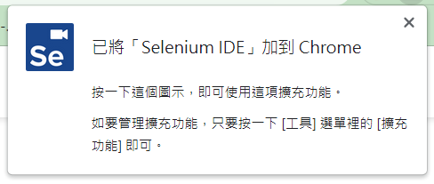
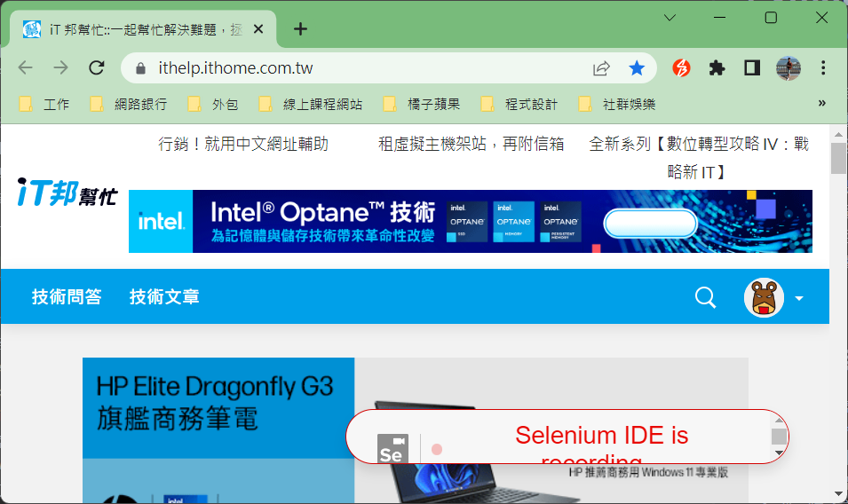
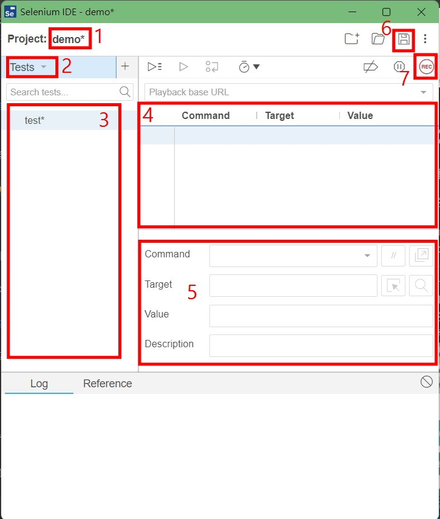
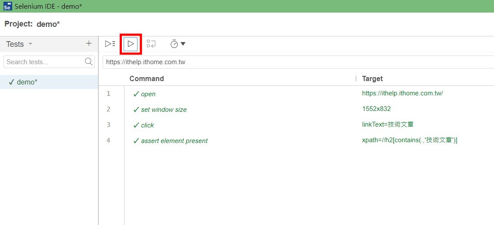
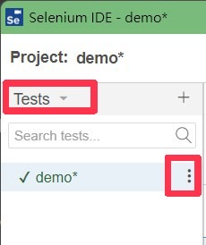

# Python 與自動化測試的敲門磚_Day19_Selenium IDE 腳本錄製

每天的專案會同步到 github 上，可以前往 [這個網址](https://github.com/nickchen1998/2022_ithelp_marathon) 如果對於專案有興趣或是想討論一些問題，歡迎留言 OR 來信討論，信箱為：nickchen1998@gmail.com

Selenium IDE 是一個瀏覽的擴充套件，常見的瀏覽器上均有提供，如它的名稱所示，他是一個可以操作 Selenium 的 IDE，我們可以透過他進行腳本的錄製，
並建立驗證項目，來減少測試開發人員撰寫程式的時間，甚至是提供沒有測試部門的公司直接進行測試計畫的建立，讓相關人員可以在不需要具備太多程式背景的條件下，
也可以輕鬆進行測試

## 一、安裝 Selenium IDE
1. 前往這個網址：[https://chrome.google.com/webstore/detail/selenium-ide/mooikfkahbdckldjjndioackbalphokd](https://chrome.google.com/webstore/detail/selenium-ide/mooikfkahbdckldjjndioackbalphokd)
2. 點選 "加到 Chrome" 選項
3. 選擇 "新增擴充功能" 選項
4. 過一陣子之後就可以在 Chrome 的右上角看到 Selenium IDE 被成功加入

    

## 二、介面介紹
### (一)、建立新專案
在開始介面介紹之前，我們先透過下面步驟建立一個簡單的測試計畫
1. 開啟 Selenium IDE
2. 選擇 "Record a new test in a new project" 選項
3. 輸入 project 名稱，範例使用 "demo"
4. 輸入此測試計畫的目標網址，此處使用 [https://ithelp.ithome.com.tw/](https://ithelp.ithome.com.tw/)
5. 點選 "START RECORD" 選項開始進行錄製
6. 點選該選項之後，就可以看到他幫我們開啟一個連覽器並且右下角有顯示 Recording 字樣

    

### (二)、介面介紹
我們可以先將剛剛開啟的瀏覽器關掉，方便我們進行介面介紹。

接下來我們將我們要介紹的部分使用紅框框起來，並搭配數字做對應的解釋


1. project name：測試計畫名稱，我們可以透過命名計畫名稱來替測試分類
2. test 分類：分別有 Tests、Test Suites、Executing，此為 Selenium IDE，表示 Test 的部分
   - Tests：會列出所有 Test case
   - Test Suites：該計畫內部中的分類，預設會有 Default Suites 的存在
   - Executing：目前正在執行測試的 test case 會出現在此分類
3. test case 列表：依照　test 分類顯示出對應的 test case
4. 指令列表：列出該 test case 當中所有的指令，並會依照順序進行執行
5. 編輯指令：每個指令都可以透過這個視窗進行編輯、更換
6. 存檔
7. 錄製按鈕：按下此按鈕後會開啟瀏覽器並進行錄製

## 三、錄製腳本展示
我們可以透過錄製腳本的方式來進行測試案例的建立，也可以透過手動插入腳本的方式進行建立，不過在驗證的部分一定是透過手動插入的，Selenium IDE 只能協助我們
錄製在我們想驗證的元素出現之前該進行甚麼樣的動作

另外經過筆者實測，建議在開始錄製之前都手動插入一行 open 命令來開啟網址，在錄製的過程中會比較順暢，下面我們就簡單錄製一個腳本給大家看

### (一)、腳本說明
我們會按照下面的步驟來進行腳本的錄製：
1. 開啟　[https://ithelp.ithome.com.tw/](https://ithelp.ithome.com.tw/)
2. 放大瀏覽器畫面
3. 點選 "技術文章"
4. 驗證 "h2 技術文章" 元素是否有出現

### (二)、腳本展示
補充：
1. 點選紅色方框按鈕可以進行單個測試程式測試，左方按鈕為執行所有測試程式
2. 建議於錄製完成後，都將第一行 open 指令中的 "Target" 修改成想要到達的網址，避免造成錯誤



## 四、驗證方式
這個部分會說明一些常用的驗證項目，也就是 assert 的選項
- assert alert：驗證是否有跳出提示視窗
- assert element present：驗證元素是否有出現
- assert element not present：驗證元素是否沒出現
- assert text：驗證元素文字是否為指定的數值
- assert not text：驗證元素是否不為指定的數值

## 五、輸出為 Python 腳本
### (一)、輸出步驟
透過下面的方式可以將錄製好的腳本輸出為 Python 以及其他語言的腳本，然後就可以交給測試部門的 RD 進行程式的重構或使用，進一步套入 CI/CD 進行自動化測試
1. 回到 Tests 分類
2. 點選要匯出的測試案例旁邊的三個按鈕

   

3. 選擇 "EXPORT" 選項
4. 選擇 "Python pytest" 選項
5. 選擇 "EXPORT" 選項

### (二)、腳本展示
透過 Selenium IDE 所輸出的 Python 腳本，可以直接執行，不如果要套入 CI/CD，或是公司本身自有的測試框架或其他種類流程的話，
都會需要進行某種程度上的重構，這時後錄製腳本的人員如果沒有程式相關背景的話，就可以交給 RD 進行重構並納入自動化測試當中，
或本身是測試部門的 RD 的話，也可以透過這個小工具來減少我們寫 code 的時間，獲取更多偷懶的機會

```python
# Generated by Selenium IDE
import pytest
import time
import json
from selenium import webdriver
from selenium.webdriver.common.by import By
from selenium.webdriver.common.action_chains import ActionChains
from selenium.webdriver.support import expected_conditions
from selenium.webdriver.support.wait import WebDriverWait
from selenium.webdriver.common.keys import Keys
from selenium.webdriver.common.desired_capabilities import DesiredCapabilities


class TestDemo():
    def setup_method(self, method):
        self.driver = webdriver.Chrome()
        self.vars = {}

    def teardown_method(self, method):
        self.driver.quit()

    def test_demo(self):
        self.driver.get("https://ithelp.ithome.com.tw/")
        self.driver.set_window_size(1552, 832)
        self.driver.find_element(By.LINK_TEXT, "技術文章").click()
        elements = self.driver.find_elements(By.XPATH, "//h2[contains(.,\'技術文章\')]")
        assert len(elements) > 0
        self.driver.close()
```

## 六、內容預告
今天我們介紹了 Selenium IDE 這個錄製測試腳本的小工具，他可以協助我們減少撰寫測試程式的時間，也可以讓非 RD 相關背景的人員參與測試，降低溝通成本，
不過目前這個工具還是有一些小缺點，像是不能清除 cookies、open 指令需要手動修改等，一些會造成錄製上不太方便的瑕疵，這部分就只能期待他們日後有沒有進行更新了，
明天我們會花一天的時間來補個前幾天有提到的 XPATH 使用方式的坑