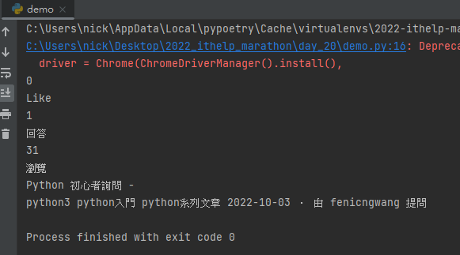
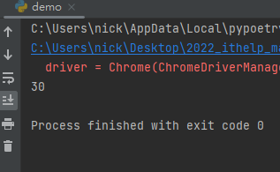

# Python 與自動化測試的敲門磚_Day20_XPATH 快速入門

每天的專案會同步到 github 上，可以前往 [這個網址](https://github.com/nickchen1998/2022_ithelp_marathon)
如果對於專案有興趣或是想討論一些問題，歡迎留言 OR 來信討論，信箱為：nickchen1998@gmail.com

今天我們要來補個坑，是有關 XPATH 的應用教學，前幾天我們提到 Selenium 元素定位的時候有提到有關 XPATH 的定位方式，
今天我們就來好好提一下他的運作邏輯

## 一、建立 driver 函式

這邊就不再贅述，直接上範例，唯一不一樣的地方是，在這個階段我們會直接開啟指定的 url 再將 driver 回傳

```python
from contextlib import contextmanager
from selenium.webdriver import Chrome
from selenium.webdriver.chrome.options import Options
from webdriver_manager.chrome import ChromeDriverManager


@contextmanager
def make_chrome_driver() -> Chrome:
    options = Options()
    options.add_argument("--headless")
    options.add_argument("--start-maximized")
    options.add_argument(f"user-agent=Mozilla/5.0 (Windows NT 10.0; Win64; x64) "
                         f"AppleWebKit/537.36 (KHTML, like Gecko) Chrome/105.0.0.0 Safari/537.36")

    driver = Chrome(ChromeDriverManager().install(),
                    options=options)
    driver.get("https://ithelp.ithome.com.tw/questions")
    yield driver
    driver.quit()
```

## 二、相對位置 XPATH

在 selenium 當中，我們可以透過相對位置的 XPATH 來定位我們的元素，語法結構大致如下：

```python
xpath = "//div[@class='board tabs-content']/div[1]"
```

- //：表示當前網頁 or 元素
- div：要尋找的 HTML tag
- []：為 XPATH 的運算邏輯，在裡面可以增加 class、id 甚至是 and 等條件，語法為 "@<屬性名稱>"，ex: @class、@id、@name...
- div[1]：同層級且同樣的元素可能會有很多個，例如：ithelp 問答葉面的問題列表，可以透過取串列的方式來取得指定的個數，若沒有預設為取得第一個找到符合條件的元素

上述的 XPATH 語法代表要取得 "class 為 board tabs-content 的 div" 底下的 "第一個 div"

範例程式：

```python
from selenium.webdriver.common.by import By


def get_question_by_relative_xpath():
    with make_chrome_driver() as driver:
        xpath = "//div[@class='board tabs-content']/div[1]"
        question = driver.find_element(By.XPATH, xpath)
        print(question.text)
```

執行結果：



## 三、取得多個元素

當你找元素時使用的是 driver.find_elements，XPATH 會協助你將所有符合條件的元素都蒐集回來，下方的範例當中就成功將問答頁面第一頁中所有的問題都爬娶回來並印出數量

範例程式：

可以看到下方範例當中，我們將最後面的 `div[1]` 取代為 `div[@class='qa-list']`，表示我們要在這一層取得所有 "class 為 qa-list
的 div"

```python
from selenium.webdriver.common.by import By


def get_questions_by_relative_xpath():
    with make_chrome_driver() as driver:
        xpath = "//div[@class='board tabs-content']/div[@class='qa-list']"
        questions = driver.find_elements(By.XPATH, xpath)
        print(len(questions))
```

執行結果：



## 四、內容預告
今天我們簡單介紹了一下 XPATH 的使用方式，有時候單純透過 CSS 找不到的元素，可以直接透過 XPATH 來尋找會快很多

明天開始我們的時程會有一點異動，會先介紹 CI/CD 與 gitlab 的概念以及操作教學，於鐵人賽的尾聲才會進入 Appium 的介紹