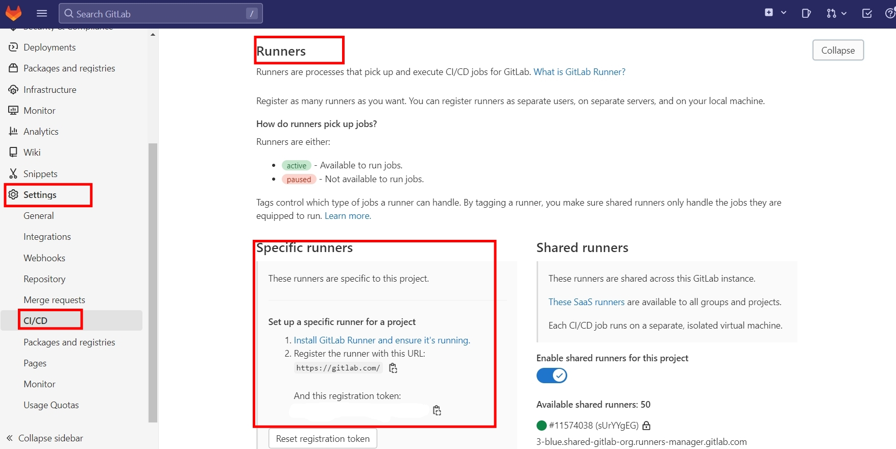
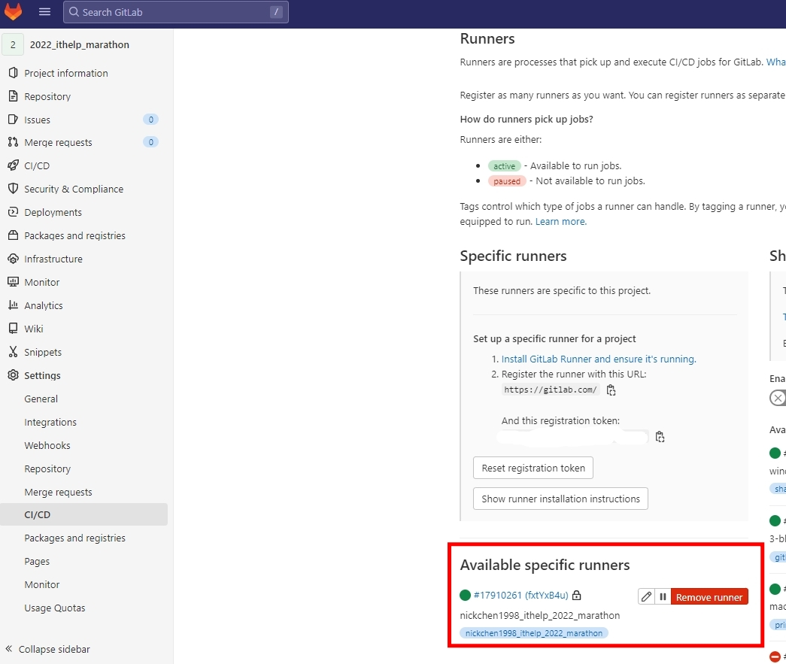
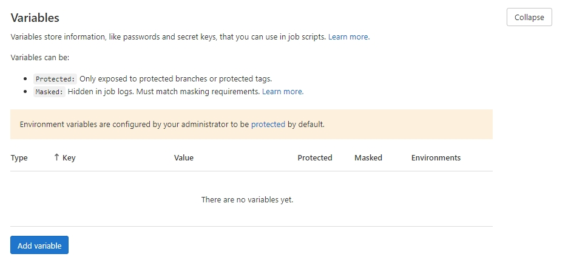
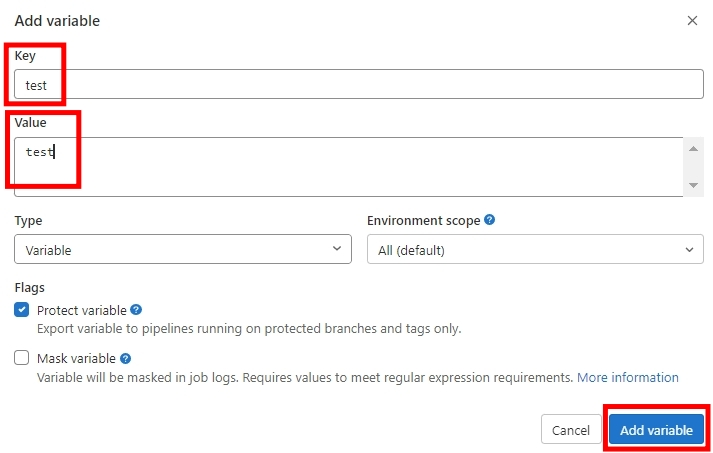

# Python 與自動化測試的敲門磚_Day24_GitLab CI/CD 介紹

每天的專案會同步到 github 上，可以前往 [這個網址](https://github.com/nickchen1998/2022_ithelp_marathon)
如果對於專案有興趣或是想討論一些問題，歡迎留言 OR 來信討論，信箱為：nickchen1998@gmail.com

由於今天要介紹 GitLab 當中的 CI/CD，因此我們將這個專案同步推上 GitLab，
可以前往 [這個網址](https://gitlab.com/nickchen1998/2022_ithelp_marathon)，
今天我們會先介紹該怎麼建立 runner，明天才會介紹該如何編輯 yaml 檔讓 GitLab 能運行 CI/CD

## 一、建立 CI/CD runner
在 GitLab 運行 CI/CD 時，同樣需要一個 runner 在背後執行，只是在 GitHub 的時候，他們幫我們做好了，
因此我們不需要去碰到這塊，下面的方法為建立 runner 並和 GitLab 上的專案綁定的方法

備註：接下來的步驟請先在要建立 runner 的電腦上安裝 docker

- 前往 GitLab 專案的 Setting 裡面的 CI/CD 頁面
- 找到 Runner 部分並打開，可以看到要和 runner 做連線的網址以及 token

    

- 打開 terminal
- 建立 docker volume

  `docker volume create gitlab-runner`

- 啟動 docker 並將他連上剛剛建立的 volume

  `docker run -d --name gitlab-runner --restart always -v /var/run/docker.sock:/var/run/docker.sock -v gitlab-runner:/etc/gitlab-runner gitlab/gitlab-runner:latest`

- 使用下方指令進行 runner 與 GitLab 的連線

  `docker run --rm -it -v gitlab-runner:/etc/gitlab-runner gitlab/gitlab-runner:latest register`

- 接下來會開始進行註冊程序，我們會以一個問題搭配一個回答的方式撰寫
  - `Enter the GitLab instance URL`：寫上剛剛在 GitLab 上看到的 url
  - `Enter the registration token`：寫上剛剛在 GitLab 上看到的 token
  - `Enter a description for the runner`：寫上你想要為這個 runner 的描述，這邊使用 "nickchen1998_ithelp_2022_marathon"
  - `Enter tags for the runner`：為這個 runner 增加 tag，用來指派 CI/CD 任務用，這邊先寫上 "nickchen1998_ithelp_2022_marathon"
  - `Enter optional maintenance note for the runner`：這部份我們不需要，直接按 Enter
  - `Enter an executor`：這邊我們輸入 "docker"，用來作為 runner 運行的環境
  - `Enter the default Docker image`：當 yaml 檔沒有指定要使用的 image 時，預設會使用的 image，這邊我們輸入 "python:latest"
  - 註冊完成

- 回到剛剛的 runner 頁面，我們就可以看到一個新的 runner 被建立給這個專案

  

## 二、設定環境變數
我們可以透過 Settings 內的 CI/CD 頁面裡面的 Variables 欄位進行環境變數的設定

- 點選右下角 Add Variable 開始設定環境變數

  

- 依序輸入 key、value 並點選 Add Variable

  

## 三、內容預告
今天我們介紹了該如何建立 GitLab 運行 CI/CD 時所需要的 runner，明天我們會介紹該如何建立在 GitLab 上運行 CI/CD 時所需要使用的 yaml 檔