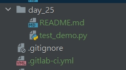
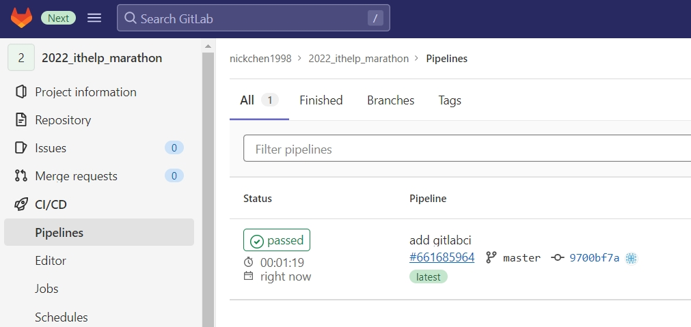
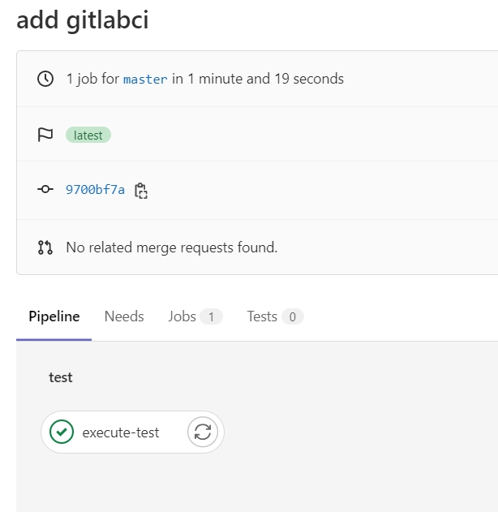
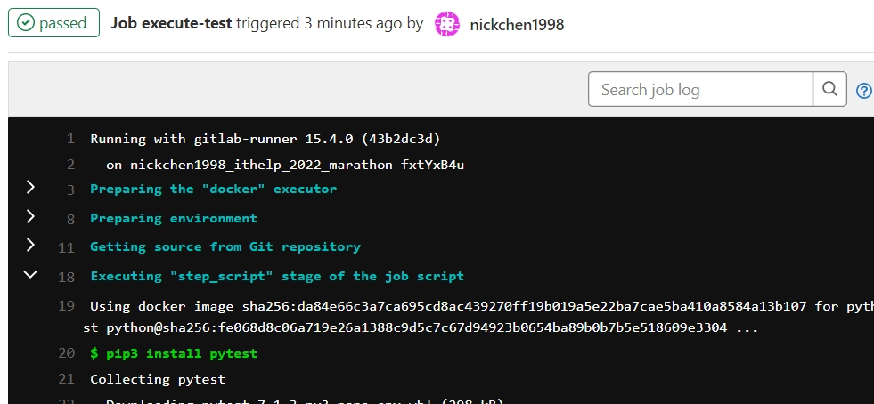

# Python 與自動化測試的敲門磚_Day25_GitLab CI/CD yaml 設定

每天的專案會同步到 github 上，可以前往 [這個網址](https://github.com/nickchen1998/2022_ithelp_marathon)
如果對於專案有興趣或是想討論一些問題，歡迎留言 OR 來信討論，信箱為：nickchen1998@gmail.com

今天我們要來介紹如何設定在 GitLab 上的 yaml 檔案，讓 GitLab 可以替我們進行自動化測試以及部屬

## 一、建立 .gitlab-ci.yml

- 在整個專案的 "最外層" 建立 `.gitlab-ci.yml` 檔
- 於 day_25 內新增 test_demo.py 用來存放測試案例

  

## 二、建立流程

- 直接將工作名稱寫在最外層，並於其下一層利用 stage 表示此工作階段的名稱

  ```yaml
  execute-test:
    stage: test
  ```

- 將要執行的指令依序寫在 scripts 後方

  ```yaml
  execute-test:
    stage: test
    script:
      - pip3 install pytest
      - pytest -s -v ./day_25/test_demo.py
  ```

- 最後利用 tag 指定我們要執行這個任務的 runner (昨天文章有提到該如何建立 runner)

    ```yaml
  execute-test:
    stage: test
    script:
      - pip3 install pytest
      - pytest -s -v ./day_25/test_demo.py
    tags:
      - nickchen1998_ithelp_2022_marathon
  ```

# 三、管理 stage

- 透過設定 stage 可以來管理我們要執行哪個部份的腳本

  透過下面這段程式碼，我們就成功設定執行所有 stage 為 test 的任務了
  ```yaml
  stages:
    - test

  execute-test:
    stage: test
    script:
      - pip3 install pytest
      - pytest -s -v ./day_25/test_demo.py
    tags:
      - nickchen1998_ithelp_2022_marathon
  ```

- 將整份專案連同 .gitlab-ci.yml 一起 push 到 GitLab 上

## 四、成果展示

- 可以看到下圖中 GitLab 順利為我們生成一條 CI pipline

  

- 點進去後可以看到他替我們生成了 test 這個 stage 並且生成了一個名為 execute-test 的任務

  

- 點選想查看的任務即可跳轉至任務執行時詳細的 log

  

## 五、內容預告

今天我們介紹了如何編寫 GitLab 的 yaml 來替我們執行 CI/CD，明天我們會介紹該如何在 GitLab 上進行 Selenium 與前端的測試
