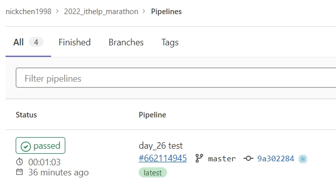

# Python 與自動化測試的敲門磚_Day26_GitLab CI/CD 與 Selenium

每天的專案會同步到 github 上，可以前往 [這個網址](https://github.com/nickchen1998/2022_ithelp_marathon)
如果對於專案有興趣或是想討論一些問題，歡迎留言 OR 來信討論，信箱為：nickchen1998@gmail.com

今天我們要來介紹該如何透過 GitLab CI/CD 來替我們進行 Selenium 的前端自動化測試，或是使用 Selenium 開發的爬蟲，
同樣也可以透過每次的 push 來自動進行驗證爬蟲是否正常，如果有錯誤或對方網站有改版的話就可以及時發現

## 一、修改 .gitlab-ci.yml 設定檔案

首先我們要替我們的 .gitlab-ci.yml 加上 service 表示我們要在指定的任務中運行其他服務

```yaml
stages:
  - test

execute-test:
  stage: test

  services:

  script:
    - pip3 install -r ./requirements.txt
    - pytest -s -v ./day_26/test_demo.py
  tags:
    - nickchen1998_ithelp_2022_marathon
```

接著透過設定 services 底下的 name 參數來指定我們要使用哪個 docker image，
我們會需要使用到 `selenium/standalone-chrome` 這個 image 來替我們建立一個可以遠端執行 Chrome 的環境

```yaml
stages:
  - test

execute-test:
  stage: test

  services:
    - name: selenium/standalone-chrome

  script:
    - pip3 install -r ./requirements.txt
    - pytest -s -v ./day_26/test_demo.py
  tags:
    - nickchen1998_ithelp_2022_marathon
```

最後透過設定 alias 參數來為這個 services 進行命名

```yaml
stages:
  - test

execute-test:
  stage: test

  services:
    - name: selenium/standalone-chrome
      alias: CICD_Selenium

  script:
    - pip3 install -r ./requirements.txt
    - pytest -s -v ./day_26/test_demo.py
  tags:
    - nickchen1998_ithelp_2022_marathon
```

透過上面的步驟，我們即可在這個任務當中開啟一個 selenium/standalone-chrome 的 container 並命名為 CICD_Selenium

## 二、建立 fixture

建立一個 `conftest.py` 並將 driver 的 fixture 寫在裡面，接著我們直接透過範例進行講解

可以看到下方的程式當中，筆者使用 sys 來辨認該目前的作業系統為何，依照筆者目前的情況，只要是 win32 代表著測試是在本地端運行，
因此會回傳出一個透過 Chrome 建立的 driver，而只要是系統為 linux 的情況 (runner 內部為 linux)，就表示一定會是使用 runner
進行測試，
因此回傳出一個使用 Remote 建立的 driver，透過 Remote 建立的 driver 可以協助我們將 selenium 的測試腳本利用遠端的 chrome
執行，
配合上一步驟所建立的 selenium chrome container，即可不須另外撰寫腳本進行 chrome 的安裝

當然判斷什麼時候該回傳哪種 driver 這部分也可以透過環境變數來進行控制，可以依照自己的使用情境來進行判斷

```python
import sys
import pytest
from typing import Union
from selenium.webdriver import Remote, Chrome
from selenium.webdriver.chrome.options import Options
from webdriver_manager.chrome import ChromeDriverManager


@pytest.fixture(name="driver")
def driver_fixture() -> Union[Remote, Chrome]:
    options = Options()
    options.add_argument("--headless")
    options.add_argument(f"user-agent=Mozilla/5.0 (Windows NT 10.0; Win64; x64) "
                         f"AppleWebKit/537.36 (KHTML, like Gecko) Chrome/105.0.0.0 Safari/537.36")

    if sys.platform == "win32":
        driver = Chrome(ChromeDriverManager().install(),
                        options=options)
    else:
        driver = Remote(command_executor="http://CICD_Selenium:4444/wd/hub",
                        options=options)

    yield driver

    driver.quit()
```

## 三、撰寫測試程式

這邊就不多說，直接上範例，不論是透過 Chrome 或是 Remote 建立的 driver，撰寫腳本的方式都一樣，不會有所改變

```python
from selenium.webdriver import Remote, Chrome
from typing import Union


def test_current_url(driver: Union[Remote, Chrome]):
    driver.get("https://ithelp.ithome.com.tw/")

    correct_url = "https://ithelp.ithome.com.tw/"
    assert driver.current_url == correct_url

    correct_title_start = "iT 邦幫忙"
    assert driver.title.startswith(correct_title_start)
```

## 四、成果展示

可以看到我們成功的建立了一個 CI 任務，並且結果為 PASS
