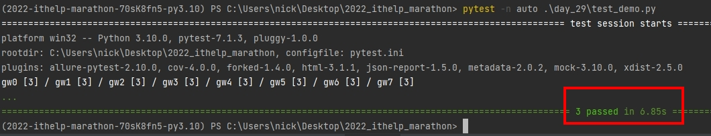

# Python 與自動化測試的敲門磚_Day29_Pytest 與併發測試

每天的專案會同步到 github 上，可以前往 [這個網址](https://github.com/nickchen1998/2022_ithelp_marathon)
如果對於專案有興趣或是想討論一些問題，歡迎留言 OR 來信討論，信箱為：nickchen1998@gmail.com

當今天測試案例很多時，相對地就會拉長我們的測試時間，筆者這邊有找到一個套件叫做 pytest-xdist，
可以協助我們將 pytest 用併發的方式進行測試，白話來說就是同時進行很多個測試，而不是一個測完才接著下一個

## 一、套件安裝
```shell
pip install pytest-xdist
```
or
```shell
poetry add pytest-xdist
```

## 二、建立測試程式
建立三個測試程式，並於每個測試案例內都進行等待五秒
```python
from time import sleep


def test_case_1():
    sleep(5)


def test_case_2():
    sleep(5)


def test_case_3():
    sleep(5)
```

## 三、成果展示
- 未使用併發測試時，可以看到測試總共花了 15 秒左右
    
    

- 使用 pytest -n auto 表示要使用併發模式進行測試，可以看到測試時間只花了六秒鐘左右
  
    

## 四、警語
併發數量若使用 auto 會自動抓取電腦 CPU 核心數，來建立併發數量，一般建議使用 CPU 核心數 / 2 的併發數量來進行測試，
可以透過 `pytest -n <concurrency_amount>` 來進行併發數量的設定，例如：`pytest -n 3 ./day_29/test_demo.py`