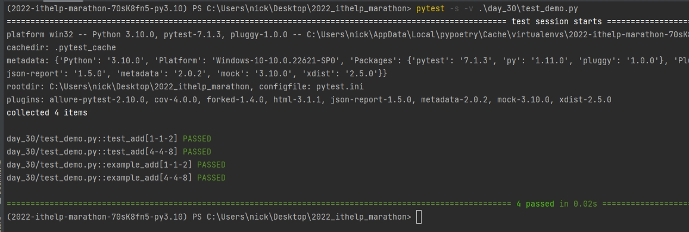
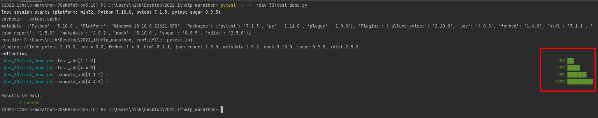
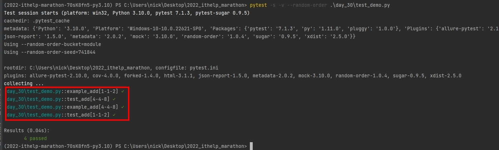

# Python 與自動化測試的敲門磚_Day30_Pytest 測試輸出美化與隨機測試

每天的專案會同步到 github 上，可以前往 [這個網址](https://github.com/nickchen1998/2022_ithelp_marathon)
如果對於專案有興趣或是想討論一些問題，歡迎留言 OR 來信討論，信箱為：nickchen1998@gmail.com

今天我們要介紹該如何美化我們在進行測試時終端機的輸出，以及讓我們的測試可以隨機的進行

下方為本次會使用到的測試案例，透過參數化的方式建立四次測試
```python
import pytest

argvalues = [[1, 1, 2], [4, 4, 8]]


@pytest.mark.parametrize(argnames='num1, num2, result', argvalues=argvalues)
def test_add(num1: int, num2: int, result: int):
    assert num1 + num2 == result


@pytest.mark.parametrize(argnames='num1, num2, result', argvalues=argvalues)
def example_add(num1: int, num2: int, result: int):
    assert num1 + num2 == result
```

## 一、測試輸出美化

### (一)、套件安裝

```shell
pip install pytest-sugar
```

or

```shell
poetry add pytest-sugar
```

### (二)、結果展示

- 沒有使用 pytest-sugar 的終端機測試輸出畫面

  

- 有使用 pytest-sugar 的終端機測試輸出畫面

  

## 二、隨機測試

在 pytest 當中，測試預設是一個接著一個按順序進行測試的，若想要隨機進行測試，可以透過安裝 pytest-random-order 這個第三方套件來協助我們進行

### (一)、套件安裝

```shell
pip install pytest-random-order
```

or

```shell
poetry add pytest-random-order
```

### (二)、成果展示

可以看到下圖當中我們成功將測試打散進行測試



## 四、結語
在本次的鐵人賽當中，我們介紹了 pytest、Selenium、TDD 以及 CI/CD 的應用，由於筆者自身時程安排的問題，
原定要介紹的 Appium 以及 Jenkins 這兩個部份就沒有介紹到，這個部份我們可以留到下次鐵人賽，或是用其他時間另開一篇文章進行解說，
非常感謝大家這 30 天以來的陪伴